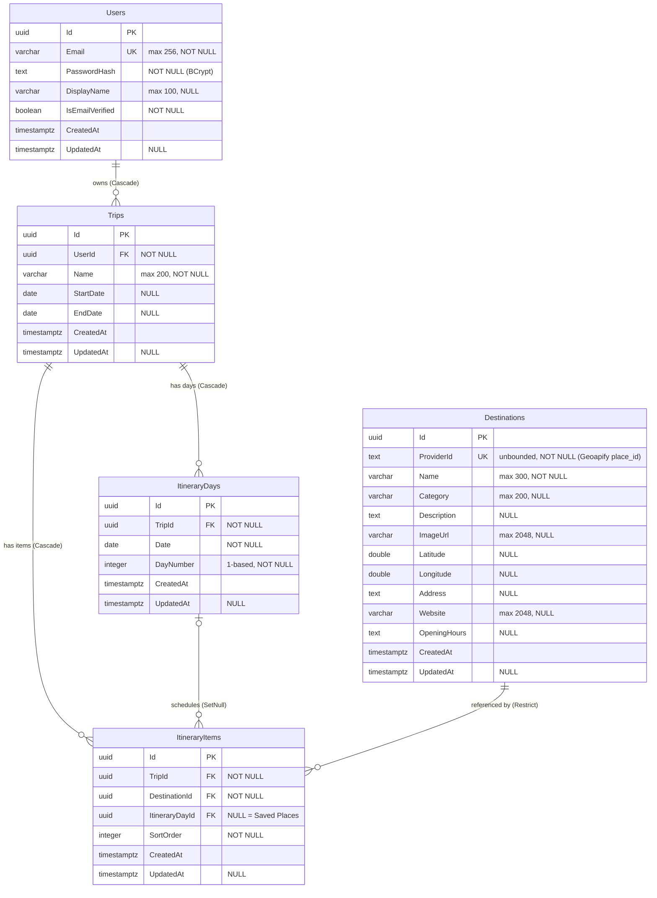

# TripPlanner — Technical Specification & Implementation Reference

> **Scope of this document.** Part A (§1–§10) is reverse-engineered strictly from the
> code present in this repository — it describes what the code *actually does*.
> Part B (§11–§13) is the forward-looking reference for implementing the remaining
> features: full feature specifications (business rules, contracts, algorithms, edge
> cases) and a step-by-step implementation roadmap. An AI or human implementer should
> treat Part A as ground truth about the existing system and Part B as the work order.
> Throughout Part A, statements are tagged:
>
> - **[Observed]** — directly visible in source code, configuration, or migrations.
> - **[Inferred]** — strongly implied by the implementation (e.g. behavior that follows
>   from framework defaults or from how components are wired), but not written as an
>   explicit statement in the code.
>
> The single most important AS-IS fact: **all four features are implemented.**
> Feature 4 (Authentication, including optional email verification) is the reference
> slice; Feature 1 (Destination Suggestion), Feature 2 (Destination Details), and
> Feature 3 (Trip Planner, including the US4–US6 drag-and-drop reorder/move-between-days
> logic) have since been built out by the student and are no longer stubs. A
> Repository + Unit of Work pattern replaced direct `DbSet<T>`/`IApplicationDbContext`
> access (that interface no longer exists anywhere in the codebase), and every public
> service method now validates its input through a FluentValidation validator before
> doing any work. [Observed]

---

## 1. Project Overview

### 1.1 What the system is

**[Observed]** TripPlanner is a training-capstone template for a travel trip-planning
web application, defined by [ASSIGNMENT.md](ASSIGNMENT.md). The intended product lets
users search destinations, view details, and organize destinations into a day-by-day
trip itinerary. The repository contains:

- A **.NET 10 Web API backend** (`backend/`) structured as a 4-project Clean
  Architecture solution ([TripPlanner.sln](backend/TripPlanner.sln)).
- A **React 19 + TypeScript + Vite frontend** (`frontend/`).
- An xUnit test project covering Auth, Trips, Destinations, the generic repository,
  and JWT token generation (5 test classes, 78 tests total).
- Dev tooling: `start-dev.bat` / `dev.ps1` / `dev.sh` launch scripts and an optional
  PostgreSQL `docker-compose.yml`.

### 1.2 What actually works today

| Feature (per ASSIGNMENT.md) | Backend state | Frontend state |
|---|---|---|
| **F4 — User Authentication** (register, login, logout, JWT, email verification) | ✅ Fully implemented ([AuthService.cs](backend/src/TripPlanner.Application/Features/Auth/AuthService.cs), [AuthController.cs](backend/src/TripPlanner.WebApi/Controllers/AuthController.cs)) | ✅ Implemented (LoginPage, RegisterPage, VerifyEmailPage, AuthContext, ProtectedRoute) |
| **F1 — Destination Suggestion** (search, attractions) | ✅ Fully implemented ([DestinationService.cs](backend/src/TripPlanner.Application/Features/Destinations/DestinationService.cs), [GeoapifyClient.cs](backend/src/TripPlanner.Infrastructure/ExternalApis/GeoapifyClient.cs)) | ✅ Implemented (SearchPage, CitySearchInput, AttractionsList, NearbyAttractions) |
| **F2 — Destination Details** | ✅ Fully implemented (`DestinationService.GetDetailsAsync`, provider-first with a DB fallback) | ✅ Implemented (DestinationDetailsPage with a photo carousel) |
| **F3 — Trip Planner** (CRUD, itinerary, scheduling, drag-and-drop reorder/move) | ✅ Fully implemented — all seven `ITripService` methods ([TripService.cs](backend/src/TripPlanner.Application/Features/Trips/TripService.cs)) | ✅ Implemented (TripsPage, TripDetailPage with native HTML5 drag-and-drop) |
| **F4/US2 — Email verification** | ✅ Implemented as a hard gate: users are created with `IsEmailVerified = false`, `LoginAsync` throws (403) until a one-time link flips it to `true` (`AuthService.VerifyEmailAsync`); `RegisterAsync` no longer issues a session | ✅ Implemented (VerifyEmailPage; RegisterPage shows a "check your email" state instead of auto-login; LoginPage shows the blocked state + a resend action) |

**[Observed]** All routes, DTOs, domain entities, EF Core mappings, the initial database
migration, JWT auth plumbing, exception middleware, DI wiring, and Swagger are fully in
place, and every feature slice now has an executable implementation behind it — the
`AuthController`/`AuthService` doc comments still label Auth the "REFERENCE
IMPLEMENTATION" others were meant to be modeled on, but that framing is now historical:
Destinations and Trips have their own real business logic (caching, upsert-on-first-add,
day regeneration, ownership filtering), not a copy of Auth's.

**[Observed] Scaffolding wording has been cleaned up:** no source file still carries
"STUB — students implement this" or "TODO (students): implement ..." — `GeoapifyClient.cs`,
`ITripService.cs` and `IDestinationService.cs` were the last three and now document what
they actually do. A repo-wide search for `TODO`/`FIXME`/`NotImplementedException` in
`backend/src` and `frontend/src` returns only `ExceptionHandlingMiddleware`'s 501 mapping,
which is deliberate (see §"Exception mapping").

### 1.3 Cross-cutting conventions confirmed by the implementation

**[Observed]** What §1.3 previously described as scaffolding-only intent is now real,
executable behavior — see §3 for the full flow and §6 for the rule-by-rule table.
In summary: location autocomplete is capped at 5 results and attractions at 20 per
page within a caller-supplied radius (default 20 km, capped at 50 km); trips with a
date range generate one `ItineraryDay` per date (regenerated whenever the range
changes, via `TripService.RegenerateDays`); items with no day sit in an unscheduled
"Saved Places" bucket (`ItineraryItem.ItineraryDayId == null`); per-bucket ordering via
`SortOrder`, kept dense (0..n) by `TripService.Resequence`; and a destination cannot
appear twice in the same day or twice in Saved Places, enforced both by the DB unique
index and by an app-level check before insert.

### 1.4 Scope limitations

- **[Observed]** Still true: no refresh tokens (only a short-lived JWT access token
  plus a separate purpose-scoped email-verification token — see §9's Authentication
  details), no roles/permissions, no logging beyond default ASP.NET Core logging plus
  one `ILogger.LogError` call for unhandled (500) exceptions, no CI configuration (no
  `.github/workflows` or other CI config in the repo).
- **[Observed]** No longer true: the frontend now has full API wrappers
  (`api/destinations.ts`, `api/trips.ts` alongside `api/auth.ts`) and TypeScript types
  for every DTO in [types.ts](frontend/src/types.ts); `DestinationService` now has an
  in-process caching layer (`IMemoryCache`, cache-aside with stale-while-revalidate
  fallback — see §3.2).

---

## 2. Existing Code Structure (AS-IS)

### 2.1 Repository layout

```
backend/
  TripPlanner.sln
  Directory.Build.props            # net10.0, nullable enable, implicit usings
  src/
    TripPlanner.Domain/            # entities, DomainException — zero dependencies
    TripPlanner.Application/       # services, DTOs, interfaces, app exceptions
    TripPlanner.Infrastructure/    # EF Core, JWT, BCrypt, Geoapify client, migrations
    TripPlanner.WebApi/            # controllers, middleware, Program.cs (no appsettings.json — see §10 Configuration summary)
  tests/
    TripPlanner.UnitTests/    # Domain + Application + Infrastructure — 21 classes, 279 tests
    TripPlanner.WebApi.Tests/ # WebApplicationFactory integration — 7 classes, 69 tests
frontend/
  src/
    api/          # client.ts (axios + JWT interceptor + 401 logout interceptor),
                  # auth.ts, destinations.ts, trips.ts
    auth/         # AuthContext.tsx, ProtectedRoute.tsx
    features/     # auth/, destinations/, trips/ — all implemented
    types.ts, App.tsx, main.tsx, styles.css
docker-compose.yml  # optional Postgres 17
start-dev.bat / dev.ps1 / dev.sh
```

### 2.2 Project dependency graph

**[Observed]** from `<ProjectReference>` entries in the `.csproj` files:

```
WebApi ──▶ Application ──▶ Domain
   │             ▲
   └──▶ Infrastructure ──┘   (Infrastructure ──▶ Application ──▶ Domain)
```

- `TripPlanner.Domain` references **nothing** (no packages, no projects).
- `TripPlanner.Application` references Domain + `FluentValidation.DependencyInjectionExtensions`
  + `Microsoft.Extensions.Caching.Abstractions` + `Microsoft.Extensions.DependencyInjection.Abstractions`.
  It does **not** reference `StackExchange.Redis`, `Microsoft.Extensions.Caching.StackExchangeRedis`,
  or any other cache-backend package — `DestinationService` depends only on
  `IDistributedCache` and never sees a backend-specific exception type; a connectivity
  failure is absorbed by `ResilientDistributedCache` (Infrastructure — see the Cache
  entry under §10 Third-party services) before it reaches Application. It does
  **not** reference `Microsoft.EntityFrameworkCore` at all (confirmed by grep — zero
  matches in the `.csproj` or any `.cs` file under this project); the repository
  abstractions it depends on (`IRepository<T>`, `IUnitOfWork`, `IUserRepository`,
  `ITripRepository`, `IDestinationRepository`) are plain interfaces with no EF types
  in their signatures.
- `TripPlanner.Infrastructure` references Application; carries the EF Core Npgsql
  provider, JWT, BCrypt packages, plus the repository implementations.
- `TripPlanner.WebApi` references Application and Infrastructure; carries
  JwtBearer, EF Design, Swashbuckle, `DotNetEnv`.

### 2.3 Where business logic lives

**[Observed]** All business logic sits in the **Application layer** (`AuthService`,
`DestinationService`, `TripService`), plus one domain method (`Trip.SetDates`) and
DB-level constraints in Infrastructure entity configurations. Controllers are thin
pass-throughs: they bind the request, call one service method, and wrap the result in
`Ok(...)` / `CreatedAtAction(...)` / `NoContent()`. No business logic exists in
controllers.

### 2.4 Separation of concerns

**[Observed]** Separation is real, not just cosmetic:

- The Application layer consumes only interfaces it defines itself
  (`IRepository<T>`, `IUnitOfWork`, `IUserRepository`, `ITripRepository`,
  `IDestinationRepository`, `IPasswordHasher`, `IJwtTokenGenerator`,
  `ICurrentUserService`, `IDestinationProvider`); implementations live in
  Infrastructure/WebApi and are bound in DI extension methods
  ([Application/DependencyInjection.cs](backend/src/TripPlanner.Application/DependencyInjection.cs),
  [Infrastructure/DependencyInjection.cs](backend/src/TripPlanner.Infrastructure/DependencyInjection.cs)).
- A generic `IRepository<T>` + `IUnitOfWork` pair, plus per-entity repository
  interfaces for `User`, `Trip`, and `Destination` (see
  [docs/superpowers/specs/2026-07-25-repository-pattern-design.md](docs/superpowers/specs/2026-07-25-repository-pattern-design.md)),
  is the data-access layer services depend on. The Application layer takes no
  package dependency on `Microsoft.EntityFrameworkCore` — a unique-index
  violation surfaces from `IUnitOfWork.SaveChangesAsync` as the EF-agnostic
  `ConcurrencyException`, which services catch and translate into a
  feature-specific `ConflictException`. [Observed]

---

## 3. Functional Behavior (From Code)

### 3.1 Feature 4 — Authentication (IMPLEMENTED)

#### Register (`AuthService.RegisterAsync`)

**Flow [Observed]:**
1. Validation runs **first**, via `RegisterRequestValidator` (FluentValidation): email
   must be non-blank and contain `'@'`; password must be at least **8 characters**
   (`RegisterRequestValidator.MinPasswordLength = 8`). Failures are converted by
   `ValidateAndThrowAppExceptionAsync` into a field→messages dictionary and thrown as
   `ValidationException` (→ HTTP 400).
2. Email is normalized: `Trim().ToLowerInvariant()`
   ([AuthService.cs:66](backend/src/TripPlanner.Application/Features/Auth/AuthService.cs:66),
   `NormalizeEmail`).
3. Uniqueness check: `IUserRepository.ExistsByEmailAsync(email)` (translates to
   `Set.AnyAsync(u => u.Email == email)` inside `UserRepository`). If taken, throws
   `ConflictException` (→ 409) with the deliberately generic message
   *"Unable to register with the provided details."* — the comment states this avoids
   account enumeration.
4. User is created with BCrypt password hash, trimmed `DisplayName` (blank → `null`),
   and `IsEmailVerified = false` — F4/US2, flipped to `true` only once the emailed
   verification link is opened (`AuthService.cs:82`).
5. Saved via `SaveChangesAsync`. A verification email is then sent
   (`SendVerificationEmailAsync`) with a link to
   `{FrontendBaseUrl}/verify-email?token=...`; **registration still succeeds even if
   the email itself fails to send** (SMTP down/misconfigured is caught and swallowed —
   see "Email verification" below) so a mail outage never blocks sign-up.
6. Only a `UserDto` is returned — **no JWT, no session**. F4/US2 is a hard login gate
   (see "Login" below), so handing back a working access token at registration would
   bypass it; the frontend shows a "check your email" success state instead of
   navigating into the app.

**Edge cases handled [Observed]:** whitespace-only display name → null; mixed-case
email → lowercased; SMTP failure during registration does not roll back the created
account; registration does not persist a frontend session (all asserted by
`AuthServiceTests`).

**Edge cases NOT handled [Observed]:**
- The email check `Contains('@')` accepts strings like `"a@"`; there is no full
  email-format validation.
- Check-then-insert race: two concurrent registrations of the same email could both
  pass `ExistsByEmailAsync`; the DB unique index on `Users.Email` would then cause
  `UnitOfWork.SaveChangesAsync` to catch the resulting `DbUpdateException` and rethrow
  it as `ConcurrencyException` (see §2.4) — but `AuthService.RegisterAsync` has no
  `catch (ConcurrencyException)` block, so it propagates uncaught. `ConcurrencyException`
  is not one of the types `ExceptionHandlingMiddleware` maps to a status code, so it
  falls through to the generic **500** case, not 409. [Inferred from the absence of any
  `ConcurrencyException` handling in `AuthService` + the unique index in the migration —
  this is the same user-visible gap the original spec described, but the exception type
  involved changed from a raw `DbUpdateException` to the repository layer's
  `ConcurrencyException` after the Repository/UnitOfWork rewrite]
- No password complexity rules beyond length; no maximum length; no rate limiting.

#### Email verification (`AuthService.VerifyEmailAsync` / `ResendVerificationEmailAsync`)

**Flow [Observed] (F4/US2):**
1. `VerifyEmailAsync(token)` validates the token via
   `IJwtTokenGenerator.ValidateEmailVerificationToken` — a JWT signed with the same key
   as access tokens but issued for a **distinct audience**
   (`{Audience}.email-verification`) and carrying a `purpose: email_verification`
   claim, so a normal access token can never be replayed here and this token can never
   authenticate against an `[Authorize]` endpoint. An invalid/expired/wrong-purpose
   token throws `ValidationException` (→ 400) with a generic "invalid or expired" message.
2. On a valid token the user is looked up by the id embedded in the token (404 if
   somehow gone) and `IsEmailVerified` is flipped to `true` (idempotent — a second
   verification of an already-verified user is a no-op, no extra save).
3. `ResendVerificationEmailAsync` is **anonymous** (no `[Authorize]`, no JWT read) —
   it takes `{ Email }` in the request body instead of the current user, because a
   blocked (unverified) user has no session to authenticate with in the first place.
   It looks the user up by email and returns the *same* generic 200 response whether
   the email doesn't exist, is already verified, or is unverified — only the last case
   actually sends anything, but the response gives no indication which happened
   (anti-enumeration). **[Observed gap]** the three branches are not equal-time: the
   unverified branch additionally performs a real SMTP send before returning, so
   response *timing* (not body/status) can still distinguish "registered but
   unverified" from the other two cases.
4. Both the register-time send and the resend share `SendVerificationEmailAsync`,
   which swallows `SmtpException`/`SocketException` (transient mail failures) so a
   flaky/unconfigured SMTP relay never surfaces as an error to the caller.

**[Observed]** `SmtpEmailSender` is a no-op (returns without sending or throwing) when
`Smtp:User`/`Smtp:AppPassword` are unconfigured, so a fresh clone with no `.env`
silently sends no verification emails at all — registration and the resend endpoint
both behave as if they succeeded.

#### Login (`AuthService.LoginAsync`)

**Flow [Observed]:** normalize email → `GetByEmailAsync` → if user is
missing **or** `BCrypt.Verify` fails, throw `UnauthorizedException("Invalid email or
password.")` (→ 401). The error message is identical for both failure modes
(anti-enumeration, per code comment). **Only once the password check succeeds** does
it check `IsEmailVerified`; if `false`, throws `ForbiddenException("Please verify your
email before logging in.")` (→ 403) — this ordering matters, since checking
verification status before the password would leak account existence to a
wrong-password guess. On success (password correct **and** verified) returns
`AuthResponse(AccessToken, ExpiresAt, UserDto)`.

**Edge case NOT handled [Observed]:** when the user does not exist, no dummy hash
verification is performed — the code comment itself notes it "short-circuits for
clarity", so a timing side-channel between "unknown email" and "wrong password"
exists.

#### Logout

**[Observed]** Purely client-side: `AuthContext.logout()` removes the token and user
from `localStorage`. There is no server-side token revocation endpoint; issued JWTs
remain valid until expiry.

#### Session persistence (frontend)

**[Observed]** `AuthContext` stores the JWT under `localStorage["tripplanner.token"]`
and the user object under `localStorage["tripplanner.user"]`. An axios request
interceptor in [client.ts](frontend/src/api/client.ts) attaches
`Authorization: Bearer <token>` to every request when a token exists.

**[Observed] No longer a gap:** `client.ts` now has a **response interceptor** too — a
401 on any request that was carrying a token (i.e. not a failed login/register, which
also 401s but never had a token to expire) clears the stored token/user and dispatches
a `tripplanner:auth-logout` `window` event; `AuthContext` listens for that event and
clears its in-memory session, so an expired/revoked JWT now forces a logout on the next
API call instead of leaving the UI stuck showing an authenticated user.
**[Observed gap, still true]** Nothing proactively checks `expiresAt` client-side — the
stale-session detection is still reactive (only fires once some API call actually
returns 401), not a timer or a pre-flight check before the token's known expiry.

### 3.2 Feature 1 & 2 — Destinations (IMPLEMENTED)

`DestinationService` ([DestinationService.cs](backend/src/TripPlanner.Application/Features/Destinations/DestinationService.cs))
implements search, attractions, and details over `IDestinationProvider`
(`GeoapifyClient`) plus an `IImageSearchProvider` (`SerperImageClient`, Serper's Google
Images proxy) for thumbnails, fronted by an in-process `IMemoryCache`.

#### Search locations (`SearchLocationsAsync`) — F1/US1-US2

**Flow [Observed]:**
1. Trim the query; validate via `SearchLocationsRequestValidator` — non-empty, **≥ 2
   characters** — throwing `ValidationException` (→ 400) otherwise.
2. Cache-aside on the lowercased, trimmed query (`loc:{query}`, 24 h TTL): a fresh hit
   skips the provider call entirely.
3. On a miss, call `GeoapifyClient.SearchLocationsAsync` (Geoapify autocomplete with
   **no** `type=` restriction, keeping only `result_type` `city`/`country` via a
   client-side filter), then **dedupe** by `(name, country)`,
   **rank** exact match → prefix match → everything else (`RelevanceRank`), and
   **cap at 5** (`MaxLocationResults`).

**Edge cases handled [Observed]:** case-insensitive cache key and dedupe key so
"Paris"/"paris" share one cache entry and one result set.
**Edge cases NOT handled [Observed]:** no rate limiting on repeated distinct queries
(each new query string is a fresh, paid Geoapify call once its cache entry is cold).

#### Attractions (`GetAttractionsAsync`) — F1/US3

**Flow [Observed]:**
1. Validate via `GetAttractionsRequestValidator` — latitude ∈ [-90, 90], longitude ∈
   [-180, 180], `0 < radiusKm ≤ 50` — throwing `ValidationException` otherwise.
2. Cache-aside keyed by coordinates rounded to ~3 decimals (~100 m) and the radius, 6 h
   TTL.
3. On a miss, call `GeoapifyClient.GetAttractionsAsync` (categories broadened past the
   spec's minimum to include parks/nature/religion/heritage/entertainment, capped at
   20 via Geoapify's own `limit`), rank by rating descending with unrated last (a
   no-op today since Geoapify never returns a rating), cap at 20
   (`MaxAttractionResults`), **then** enrich each result's `ImageUrl` via Serper —
   ranking/capping happens *before* enrichment so image-search calls (a paid API) are
   only ever spent on the ≤20 results actually returned.
4. Image enrichment (`EnrichWithImagesAsync`) runs up to 5 lookups
   (`ImageFetchConcurrency`) in parallel; one failed lookup only leaves that one
   attraction imageless, it never fails the whole list.

**Edge cases handled [Observed]:** a Geoapify/Serper outage (`HttpRequestException`,
`TaskCanceledException`, or an unparseable JSON body) falls back to a stale cache entry
if one exists ("stale-better-than-down"), rather than failing the request; stale
entries are retained up to 7 days (`CacheRetention`) past their TTL specifically to
serve as that fallback.
**Edge cases NOT handled [Observed]:** no server-side category/rating filter or
sort-order parameter — the endpoint only supports the "recommended" default sort;
per `AttractionsList.tsx:15-16`, filtering/sorting the ≤20 already-loaded results by
category/rating is a deliberate **frontend-only** concern (US4/US5), not a gap.

#### Details (`GetDetailsAsync`) — F2/US1-US2

**Flow [Observed]:**
1. Validate a non-empty `providerId` (`GetDestinationDetailsRequestValidator`).
2. Cache-aside on `details:{providerId}` (24 h TTL, provider-first): a **null**
   provider answer is deliberately never cached, so a transient "not found" doesn't
   stick around for the TTL.
3. If the provider has the place, fetch/attach a photo gallery of up to 5 images
   (`DetailsPhotoCount`) via the same Serper cache entry the attractions list uses
   (`imgs:{providerId}`), so the same place shows a consistent primary photo on both
   the list and its own details page.
4. **If the provider itself doesn't know the id** (a saved-trip destination the
   provider has since removed/renamed), falls back to the local `Destination` cache
   row via `IDestinationRepository.GetByProviderIdReadOnlyAsync` — only a miss on
   **both** the live provider and the local cache is `NotFoundException` (→ 404).

**Edge cases handled [Observed]:** provider unreachable but a stale entry exists →
serve stale rather than fail; provider 400/404 for an unrecognized id is treated as "no
such place" (`GeoapifyClient` maps both to a `null` return, not an exception).
**[Observed]** `DestinationService` never writes to the database itself — the comment
on the class and on `GetOrCreateDestinationAsync` are explicit that only
`TripService.AddDestinationAsync` upserts a `Destination` row, on first add to any trip.

### 3.3 Feature 3 — Trips (IMPLEMENTED)

`TripService` ([TripService.cs](backend/src/TripPlanner.Application/Features/Trips/TripService.cs))
implements all seven `ITripService` methods. Every method resolves the caller via
`ICurrentUserService.GetRequiredUserId()` (throws `UnauthorizedException` → 401 when
anonymous) and filters every query by that id — "someone else's trip" and "no such
trip" are indistinguishable to the caller, both surfacing as 404 (NFR 6).

#### List / get (`GetMyTripsAsync`, `GetTripAsync`)

**[Observed]** `GetMyTripsAsync` projects a lightweight `TripSummaryRow` per trip
(`ITripRepository.GetSummaryRowsForUserAsync`, translated to SQL so
`DestinationCount`/cover photo are computed by the query, not by loading every item),
then sorts by `CreatedAt` descending **in memory** (a user's trip list is small, so this
avoids a separate `ORDER BY` in the query). `GetTripAsync` loads the full graph
read-only (`Days.Items.Destination` + `Items.Destination`) filtered by
`(tripId, userId)`; a trip that exists but belongs to someone else is `NotFoundException`,
same as a nonexistent id.

#### Create / update (`CreateTripAsync`, `UpdateTripAsync`) — F3/US1-US2

**Flow [Observed]:**
1. `CreateTripAsync` validates a non-blank, ≤100-char name (`CreateTripRequestValidator`),
   trims it, and assigns `UserId` from the current user — never from client input.
2. `UpdateTripAsync` validates name + an absurd-range guard (`UpdateTripRequestValidator`:
   a date range, if both ends are set, must be **under 365 days**), then calls
   `Trip.SetDates(start, end)` — the **only** place that enforces start ≤ end, so the
   validator deliberately does not duplicate that check.
3. **Day regeneration** (`TripService.RegenerateDays`, F3/US2): computes the target set
   of dates from the new range; days whose date fell out of range are removed (their
   items' `ItineraryDayId` is set to `null` in memory, mirroring the DB's `SetNull`
   cascade, so the returned DTO already reflects the move to Saved Places); days for
   new dates in range are created; days still in range are **preserved** (their
   scheduled items are untouched); all days are then renumbered `DayNumber` 1..n in
   date order. Explicit `_itineraryDays.Add(day)`/`Remove(day)` calls are required
   because `BaseEntity` self-assigns its `Guid` key client-side, which would otherwise
   make EF Core's change-tracker misclassify a brand-new day as an existing row to
   `UPDATE`.

#### Add a destination (`AddDestinationAsync`) — F3/US3-US4/US6

**Flow [Observed]:**
1. Validate a non-empty `ProviderId` (`AddDestinationRequestValidator`); if
   `ItineraryDayId` is supplied, `EnsureDayBelongsToTripAsync` checks it belongs to
   *this* trip (→ `ValidationException` on the `ItineraryDayId` field otherwise).
2. **Upsert-on-first-add** (`GetOrCreateDestinationAsync`, spec §11.0-6): look up the
   `Destination` cache row by `ProviderId`; on a cache miss, fetch full details from
   `IDestinationProvider` (404 if the provider itself doesn't know the id), map to a
   new `Destination` entity, best-effort fill `ImageUrl` via Serper if the provider had
   none, and insert. A fresh `ProviderId` is the **normal** case, not an error — this
   path never assumes the destination must already exist.
3. **Duplicate check** (US4/US6): a destination already present in the *same* bucket
   (same day, or both in Saved Places) throws `ConflictException` (→ 409) with a
   user-facing message, checked both in memory before the save **and** by catching
   `ConcurrencyException` after the save (the DB unique index
   `(ItineraryDayId, DestinationId)` is the final authority under concurrent requests —
   see §2.4/§6).
4. New items get the next `SortOrder` in their bucket (`bucket.Max(...) + 1`, or 0 if
   the bucket is empty).
5. The `Destination` upsert has its **own** concurrency handling: if a concurrent
   request wins the race to insert the same `ProviderId` first, `GetOrCreateDestinationAsync`
   discards its own in-memory copy and re-fetches the winner's row rather than erroring.

#### Schedule / reorder / move (`UpdateItineraryItemAsync`) — F3/US4-US6

**Flow [Observed]:** the single endpoint behind drag-and-drop. Validates
`SortOrder ≥ 0` (`UpdateItineraryItemRequestValidator`); resolves the target day (null
= Saved Places) via the same `EnsureDayBelongsToTripAsync` check; the duplicate check
excludes the item being moved itself (so reordering within the same day/bucket is
always allowed); inserts the item at the requested position within the target
bucket's list (clamped — "position 99" on a 3-item bucket means "last") and calls
`Resequence` to renumber that bucket's `SortOrder` values densely (0..n); if the item
moved **between** buckets, the bucket it left is also resequenced to close the gap it
left behind. Both bucket updates commit in a **single** `SaveChangesAsync` call so a
cross-day move is atomic.

#### Remove a destination (`RemoveDestinationAsync`)

**[Observed]** `ITripRepository.GetOwnedItemAsync` fetches the item only if it belongs
to a trip owned by the caller (NFR 6) — otherwise `NotFoundException`. Leaves gaps in
`SortOrder` after removal, which is harmless since ordering is only ever relative.

#### The one Domain-layer rule

**[Observed]** `Trip.SetDates(startDate, endDate)`
([Trip.cs:29](backend/src/TripPlanner.Domain/Entities/Trip.cs:29)) throws
`DomainException` when both dates are set and `start > end`; it is now actively called
from `TripService.UpdateTripAsync` (previously unreachable when `UpdateTripAsync` was
a stub).

---

## 4. API Specification (Actual Implementation Only)

All endpoints are attribute-routed controllers under `api/[controller]`.
All error responses are `application/problem+json` (RFC 7807 `ProblemDetails`)
produced by [ExceptionHandlingMiddleware](backend/src/TripPlanner.WebApi/Middleware/ExceptionHandlingMiddleware.cs). [Observed]

### 4.1 AuthController — `api/auth` (fully functional)

| Route | Method | Auth | Request body | Success response | Error responses |
|---|---|---|---|---|---|
| `/api/auth/register` | POST | anonymous | `RegisterRequest { email, password, displayName? }` | **200 OK** `UserDto { id, email, displayName, isEmailVerified }` — **no token, no session** | **400** validation (bad email / password < 8 chars, with `errors` dictionary extension); **409** email already registered |
| `/api/auth/login` | POST | anonymous | `LoginRequest { email, password }` | **200 OK** `AuthResponse { accessToken, expiresAt, user }` | **401** "Invalid email or password."; **403** "Please verify your email before logging in." |
| `/api/auth/verify-email` | POST | anonymous | `VerifyEmailRequest { token }` | **200 OK** (no body) | **400** invalid/expired/wrong-purpose token |
| `/api/auth/resend-verification` | POST | anonymous | `ResendVerificationRequest { email }` | **200 OK** (no body; identical for unknown/already-verified/unverified emails — anti-enumeration) | **400** validation (bad email shape) |

Notes [Observed]:
- Register returns **200**, not 201 (`Ok(response)` in the controller; the
  `ProducesResponseType` attributes match).
- `[ApiController]` is present, so ASP.NET Core's automatic model-state validation
  applies to request binding; however the request DTOs carry **no DataAnnotations**,
  so in practice only malformed JSON / type mismatches produce the framework's
  automatic 400 — the real 400s for register come from FluentValidation via
  `RegisterRequestValidator`. [Inferred from `[ApiController]` + absence of annotations]

### 4.2 DestinationsController — `api/destinations` (anonymous, fully functional)

| Route | Method | Parameters | Success response | Error responses |
|---|---|---|---|---|
| `/api/destinations/locations` | GET | `query` (string, from query) | **200 OK** `IReadOnlyList<LocationSuggestionDto>` (≤5, ranked) | **400** query missing or < 2 chars |
| `/api/destinations/attractions` | GET | `lat` (double), `lng` (double), `radiusKm` (double, default **20**) | **200 OK** `IReadOnlyList<DestinationSummaryDto>` (≤20, images enriched) | **400** lat/lng out of range, or radius ≤ 0 / > 50 km |
| `/api/destinations/{providerId}` | GET | `providerId` (string, route) | **200 OK** `DestinationDetailsDto` (with `imageUrls` gallery) | **400** blank providerId; **404** unknown to both the provider and the local cache |

No `[Authorize]` — the controller's XML doc comment states these are deliberately
public so users can browse before logging in (F3/US8). [Observed]

### 4.3 TripsController — `api/trips` (`[Authorize]` on the controller, fully functional)

| Route | Method | Request | Success response | Error responses |
|---|---|---|---|---|
| `/api/trips` | GET | — | **200 OK** `IReadOnlyList<TripSummaryDto>` (caller's trips, newest first) | — |
| `/api/trips/{tripId:guid}` | GET | — | **200 OK** `TripDetailDto` (days + Saved Places) | **404** not found / not owned by caller |
| `/api/trips` | POST | `CreateTripRequest { name }` | **201 Created** (`CreatedAtAction` → `GetTrip`) `TripSummaryDto` | **400** blank/too-long name |
| `/api/trips/{tripId:guid}` | PUT | `UpdateTripRequest { name, startDate?, endDate? }` | **200 OK** `TripDetailDto` (days regenerated) | **400** blank name, range > 365 days, or start > end; **404** not found/not owned |
| `/api/trips/{tripId:guid}/destinations` | POST | `AddDestinationRequest { providerId, itineraryDayId? }` | **200 OK** `TripDestinationDto` | **400** blank providerId, or day not in this trip; **404** trip not found/not owned, or provider doesn't know the id; **409** duplicate in that bucket |
| `/api/trips/{tripId:guid}/destinations/{itemId:guid}` | PUT | `UpdateItineraryItemRequest { itineraryDayId?, sortOrder }` | **200 OK** `TripDestinationDto` | **400** negative sortOrder, or day not in this trip; **404** trip/item not found/not owned; **409** duplicate in target bucket |
| `/api/trips/{tripId:guid}/destinations/{itemId:guid}` | DELETE | — | **204 No Content** | **404** trip/item not found/not owned |

Without a valid JWT every route returns **401** (JWT bearer default challenge).
Non-GUID `tripId`/`itemId` values fail the `:guid` route constraint → **404**.
[Inferred from routing constraints + JwtBearer defaults]

### 4.4 Cross-cutting HTTP behavior

- **CORS [Observed]:** policy `AllowFrontend` allows origins from
  `Cors:AllowedOrigins` (default `http://localhost:5173`), any header, any method.
- **Swagger [Observed]:** `/swagger` in Development only, with a Bearer "Authorize"
  button.
- **HTTPS redirection is absent** — the pipeline has no `UseHttpsRedirection()`;
  the API serves plain HTTP on `http://localhost:5080`. [Observed]

---

## 5. Data Model (Actual Code Representation)

### 5.1 Domain entities (all in `TripPlanner.Domain/Entities`, no framework dependencies)

All entities inherit [BaseEntity](backend/src/TripPlanner.Domain/Common/BaseEntity.cs):
`Guid Id` (client-generated via `Guid.NewGuid()`), `DateTimeOffset CreatedAt`
(defaulted to `UtcNow` in code, not the DB), `DateTimeOffset? UpdatedAt`. [Observed]

| Entity | Fields | Relationships |
|---|---|---|
| `User` | `Email` (required), `PasswordHash` (required), `DisplayName?`, `IsEmailVerified` | 1 → many `Trips` |
| `Trip` | `UserId`, `Name` (required), `StartDate?`, `EndDate?` (`DateOnly?`) | many → 1 `User`; 1 → many `Days`, 1 → many `Items`. Method: `SetDates` (start ≤ end rule) |
| `ItineraryDay` | `TripId`, `Date` (`DateOnly`), `DayNumber` (1-based, per comment) | many → 1 `Trip`; 1 → many `Items` |
| `ItineraryItem` | `TripId`, `DestinationId`, `ItineraryDayId?` (**null = "Saved Places" bucket**, per comment), `SortOrder` | many → 1 `Trip`, `Destination`, `ItineraryDay?` |
| `Destination` | `ProviderId` (required — external provider's stable id, e.g. Geoapify `place_id`), `Name` (required), `Category?`, `Description?`, `ImageUrl?`, `Latitude?`, `Longitude?`, `Address?`, `Website?`, `OpeningHours?` | referenced by `ItineraryItem`; comment describes it as a local cache of provider data |

There are **no value objects, no enums, no domain events, and no aggregate-root
enforcement** — entities are mutable classes with public setters. [Observed]

### 5.2 DTOs (Application layer, C# records)

- **Auth:** `RegisterRequest`, `LoginRequest`, `UserDto` (now includes
  `IsEmailVerified`), `VerifyEmailRequest`, `ResendVerificationRequest { Email }`,
  `AuthResponse` — the password hash never appears in any DTO. `AuthResponse` (which
  carries the JWT) is now returned **only** by `LoginAsync`; `RegisterAsync` returns a
  bare `UserDto` since registration no longer creates a session. [Observed]
- **Destinations:** `LocationSuggestionDto`, `DestinationSummaryDto` (still includes
  `Rating` — a field that does **not** exist on the `Destination` entity; it is
  populated straight from a live provider call and is always `null` for Geoapify,
  never persisted), `DestinationDetailsDto` (now also carries `ImageUrls` — the F2/US2
  photo gallery, defaulted to `null`/empty and populated by `DestinationService`, not
  the provider client directly). Three small wrapper records
  (`SearchLocationsRequest`, `GetAttractionsRequest`, `GetDestinationDetailsRequest`)
  exist purely so each has its own FluentValidation validator.
- **Trips:** `CreateTripRequest`, `UpdateTripRequest`, `AddDestinationRequest`,
  `UpdateItineraryItemRequest` (F3/US4-US6 — schedule/reorder/move), `TripSummaryDto`
  (with computed `DestinationCount` and `CoverImageUrl`), `TripDestinationDto`,
  `ItineraryDayDto`, `TripDetailDto` (days + separate `SavedPlaces` list).

**[Observed]** Mapping is no longer manual/inline — each feature folder has a
centralized `*Mappings.cs` static class (`AuthMappings.ToDto`, `DestinationMappings.ToEntity`/`ToDetailsDto`,
`TripMappings.ToSummaryDto`/`ToDestinationDto`/`ToDayDto`/`ToDetailDto`) that every
service call site goes through; no AutoMapper. `TripMappings` additionally exposes a
compiled `Expression<Func<Trip, TripSummaryRow>>` (`ToSummaryRowExpression`) so the
trip-list projection translates to SQL (a correlated subquery for `DestinationCount`
and cover photo) while the in-memory `ToSummaryDto` extension is compiled from that
*same* expression — the two can never drift apart.

### 5.3 Frontend types

**[Observed]** [types.ts](frontend/src/types.ts) now covers every DTO consumed by the
feature pages: `User`, `AuthResponse`, `LocationSuggestion`, `AttractionSummary`,
`DestinationDetails`, `TripSummary`, `TripDestination`, `ItineraryDay`, `TripDetail`.
`api/destinations.ts` and `api/trips.ts` are thin typed wrappers over `apiClient`
following `api/auth.ts`'s pattern — no raw `fetch`/`axios` calls remain in components.

---

## 6. Business Logic (Extracted from Code)

### 6.1 Explicit, executable rules

| # | Rule | Where enforced | HTTP effect |
|---|---|---|---|
| B1 | Password ≥ 8 characters | `RegisterRequestValidator` (constant `MinPasswordLength`) | 400 |
| B2 | Email must be non-blank and contain `@` | same | 400 |
| B3 | Emails are stored/compared lowercase + trimmed | `AuthService.NormalizeEmail` | — |
| B4 | Email must be unique | `AuthService` pre-check (409) **and** unique DB index `IX_Users_Email` | 409 (app) / 500 (race — `ConcurrencyException` from `UnitOfWork` is uncaught in `AuthService`, so it isn't translated to 409; see §3.1) |
| B5 | Auth failure messages never reveal whether an account exists | generic messages in Register (409) and Login (401) | — |
| B6 | Passwords stored only as BCrypt hashes (salt embedded) | `BCryptPasswordHasher` | — |
| B7 | Trip start date must be ≤ end date (when both set) | `Trip.SetDates` throws `DomainException`, called from `TripService.UpdateTripAsync` | 400 |
| B8 | A destination cannot appear twice in the same itinerary day (or twice in Saved Places) | app-level check in `TripService.AddDestinationAsync`/`UpdateItineraryItemAsync` (409) **and** unique DB index `IX_ItineraryItems_ItineraryDayId_DestinationId` as the concurrency backstop (`ConcurrencyException` → `ConflictException`) | 409 (both paths) |
| B9 | One cached `Destination` row per external place | app-level upsert in `TripService.GetOrCreateDestinationAsync` **and** unique DB index `IX_Destinations_ProviderId` as the concurrency backstop (loser discards its row and re-fetches the winner's) | — (transparent to the caller — no error surfaces) |
| B10 | Deleting a user cascades to trips; deleting a trip cascades to its days and items | FK delete behaviors (Cascade) | — |
| B11 | Deleting an itinerary day returns its items to "Saved Places" (FK set to NULL), it does not delete them | `ItineraryDayConfiguration` `DeleteBehavior.SetNull`; mirrored in memory by `TripService.RegenerateDays` when a day falls out of a shortened date range | — |
| B12 | A `Destination` cannot be deleted while referenced by any itinerary item | `DeleteBehavior.Restrict` on `ItineraryItem.DestinationId` | — (no code path deletes a `Destination` today, so this is currently unreachable rather than exercised) |
| B13 | `UpdatedAt` is stamped automatically on modified entities at save time | `ApplicationDbContext.SaveChangesAsync` override | — |
| B14 | JWT tokens expire after `Jwt:ExpiryMinutes` (config default 60) with zero clock skew | `JwtTokenGenerator` + `TokenValidationParameters.ClockSkew = TimeSpan.Zero` | 401 after expiry |
| B15 | Users are created unverified; a purpose-scoped, 24h-expiring token flips `IsEmailVerified` once | `IsEmailVerified = false` in `RegisterAsync`; `AuthService.VerifyEmailAsync` + `JwtTokenGenerator.{Generate,Validate}EmailVerificationToken` | — |
| B16 | A trip's date range, if both ends are set, must be under 365 days | `UpdateTripRequestValidator` | 400 |
| B17 | Search queries must be ≥ 2 characters; attraction radius must be in `(0, 50]` km; latitude/longitude must be on the globe | `SearchLocationsRequestValidator` / `GetAttractionsRequestValidator` | 400 |
| B18 | `SortOrder` within a bucket (day or Saved Places) is kept dense (0..n) after any add/reorder/move/remove | `TripService.Resequence`, called from `UpdateItineraryItemAsync` — **not** a DB constraint (no unique index on `SortOrder`; see §8.4) | — |
| B19 | Trip list/detail/add/remove/reorder are all scoped to the caller (NFR 6) | every `TripService` method resolves `userId` via `ICurrentUserService.GetRequiredUserId()` and every repository query filters by it (`ITripRepository.GetSummaryRowsForUserAsync`/`GetDetailsAsync`/`GetTrackedWithFullGraphAsync`/`GetOwnedItemAsync`) | 401 anonymous; 404 for someone else's trip (indistinguishable from "doesn't exist") |
| B20 | Provider/browse results are cached (cache-aside, `IDistributedCache` — in-process by default, Redis when `Cache:Provider` is set) with TTLs of 24h (locations, details), 6h (attractions), and stale-while-revalidate fallback on a provider outage **or a cache backend outage** | `DestinationService.GetCachedAsync`/`GetCachedProviderDetailsAsync`/`GetAttractionImagesAsync` via the shared `TryGetCachedEnvelopeAsync`/`SetCachedEnvelopeAsync` helpers | — |
| B21 | Login is blocked until the email is verified — checked only after the password is confirmed correct, so a wrong-password guess never reveals verification status | `AuthService.LoginAsync` throws `ForbiddenException` when `IsEmailVerified` is `false`; registration does not issue a session, so this is the only way in | 403 |

### 6.2 Inferred / partially-enforced behavior

- **[Observed]** B8/B9/B11/B12's DB constraints are now actually exercised by live
  code paths (Repository/UnitOfWork rewrite means a unique-index violation surfaces as
  the EF-agnostic `ConcurrencyException`, not a raw `DbUpdateException`); B8 and B9 are
  each backed by an app-level check *as well*, so the DB index is a concurrency
  backstop rather than the sole enforcement — see §3.3 and B4/B8/B9 above.
- **[Observed]** The per-user authorization rule (NFR 6) is no longer just declared in
  comments — every `TripService` method resolves `userId` and every repository query
  used by a write or a scoped read filters by it (B19). This contradicts what the
  original version of this document claimed ("a contract for future code, not a rule
  the system currently enforces") — that claim is now false.
- **[Inferred]** `ICurrentUserService.IsAuthenticated` is a default interface member
  (`UserId is not null`); `CurrentUserService` reads the user id from the
  `ClaimTypes.NameIdentifier` claim first, falling back to the raw `"sub"` claim —
  the fallback exists because the JWT handler's default inbound claim mapping renames
  `sub` to `ClaimTypes.NameIdentifier`. `JwtTokenGenerator.ValidateEmailVerificationToken`
  deliberately sets `MapInboundClaims = false` on its own handler instance so it can read
  the raw `sub`/`purpose` claims without that same rename getting in the way.
- **[Inferred]** B18 (dense `SortOrder`) is an in-memory-only invariant — nothing in the
  database prevents two rows in the same bucket from sharing a `SortOrder` value if a
  future code path writes one directly instead of going through `TripService`.

---

## 7. Validation Rules (Actual Implementation)

**Validation layers actually present, in pipeline order:** [Observed]

1. **Route constraints** — `{tripId:guid}`, `{itemId:guid}` (mismatch → 404).
2. **`[ApiController]` automatic model-state validation** — catches malformed
   JSON/unbindable values only, because **no DataAnnotations exist on any DTO**.
   (The `required` properties on entities are C# compile-time `required` modifiers,
   not validation attributes.)
3. **FluentValidation, one `AbstractValidator<T>` per request DTO that needs it** —
   this is now the primary validation layer, registered in bulk via
   `services.AddValidatorsFromAssembly(...)` in
   [Application/DependencyInjection.cs](backend/src/TripPlanner.Application/DependencyInjection.cs)
   and invoked at the top of every service method via the
   `IValidator<T>.ValidateAndThrowAppExceptionAsync` extension
   ([ValidationExtensions.cs](backend/src/TripPlanner.Application/Common/Validation/ValidationExtensions.cs)),
   which bridges FluentValidation's own result type into this project's
   `Exceptions.ValidationException` (field → messages dictionary, → HTTP 400):
   - `RegisterRequestValidator` — email non-blank + contains `@`; password ≥ 8 chars.
   - `SearchLocationsRequestValidator` — query non-blank, ≥ 2 chars.
   - `GetAttractionsRequestValidator` — lat/lng on the globe; `0 < radiusKm ≤ 50`.
   - `GetDestinationDetailsRequestValidator` — providerId non-blank.
   - `CreateTripRequestValidator` — name non-blank, ≤ 100 chars.
   - `UpdateTripRequestValidator` — name non-blank/≤ 100 chars; range < 365 days
     (start ≤ end is deliberately **not** duplicated here — see item 4 below).
   - `AddDestinationRequestValidator` — providerId non-blank.
   - `UpdateItineraryItemRequestValidator` — `SortOrder ≥ 0`.

   `LoginRequest` has **no** validator — login failure is intentionally reported
   generically via `UnauthorizedException`, not per-field validation (see §3.1).
4. **Manual service-layer validation** — checks that need the database and so cannot
   live in a stateless validator: `AuthService`'s email-uniqueness check (409, not
   400), `TripService.EnsureDayBelongsToTripAsync` (a supplied `ItineraryDayId` must
   belong to the target trip), and the duplicate-destination-per-bucket checks in
   `AddDestinationAsync`/`UpdateItineraryItemAsync`.
5. **Domain validation** — `Trip.SetDates` (start ≤ end), now actively called from
   `TripService.UpdateTripAsync`.
6. **Database constraints** — required columns, max lengths (`Email` 256,
   `DisplayName` 100, `Trip.Name` 200, `Destination.Name` 300 / `Category` 200 /
   `ImageUrl` & `Website` 2048 — `Destination.ProviderId` is deliberately
   **unbounded** `text`, see §"Provider id length" below), unique indexes (B4, B8, B9),
   FK delete behaviors.

**Not present [Observed]:** action filters, custom model binders, DataAnnotations on
any DTO.

**Frontend validation [Observed]:** HTML-native only — `type="email"`, `required`,
and `minLength={8}` on the register password input; the destinations/trips forms rely
on the backend's 400 responses (surfaced via `getErrorMessage`) rather than
client-side validation.

---

## 8. Database Layer

### 8.1 DbContext, repositories, and Unit of Work

**[Observed]** [ApplicationDbContext](backend/src/TripPlanner.Infrastructure/Persistence/ApplicationDbContext.cs)
is a plain `DbContext` — **`IApplicationDbContext` no longer exists anywhere in the
codebase** (removed along with the last direct `DbSet<T>` access from the Application
layer). It exposes `DbSet`s for `Users`, `Trips`, `ItineraryDays`, `Destinations`,
`ItineraryItems`; applies all `IEntityTypeConfiguration<T>` classes from its assembly;
overrides `SaveChangesAsync` to stamp `UpdatedAt` on modified `BaseEntity` rows. Note:
only the `Modified` state is handled — `CreatedAt` comes from the C# property
initializer, not the DbContext.

**[Observed]** Nothing in Application talks to `ApplicationDbContext` directly.
Between the services and the DbContext sits:
- **`Repository<T>`** ([Repository.cs](backend/src/TripPlanner.Infrastructure/Persistence/Repositories/Repository.cs)) —
  generic `IRepository<T>` (`GetByIdAsync`, `GetAllAsync`, `Add`, `Remove`) over a
  `DbSet<T>`; registered as an open generic (`services.AddScoped(typeof(IRepository<>), typeof(Repository<>))`)
  so it directly satisfies `IRepository<ItineraryDay>`/`IRepository<ItineraryItem>`.
- **`UserRepository`, `TripRepository`, `DestinationRepository`** — derive from
  `Repository<T>` and add the entity-specific queries each service needs (e.g.
  `ITripRepository.GetDetailsAsync`/`GetTrackedWithFullGraphAsync`/`DayBelongsToTripAsync`/`GetOwnedItemAsync`,
  all filtered by `userId` where relevant — the NFR 6 enforcement point).
- **`UnitOfWork`** ([UnitOfWork.cs](backend/src/TripPlanner.Infrastructure/Persistence/UnitOfWork.cs)) —
  wraps `ApplicationDbContext.SaveChangesAsync`; catches `DbUpdateException` and
  rethrows it as the EF-agnostic `ConcurrencyException`
  ([ConcurrencyException.cs](backend/src/TripPlanner.Application/Common/Exceptions/ConcurrencyException.cs)),
  which is **not** one of the types `ExceptionHandlingMiddleware` maps to a status —
  callers must catch it themselves and translate it into a feature-specific exception
  (`TripService` does this for the two unique indexes it can race against; `AuthService`
  does not — see B4 in §6.1). This path is **not exercised by the EF Core InMemory
  provider** used in the test suite (InMemory doesn't enforce non-key unique indexes at
  all, and throws a raw `ArgumentException` rather than `DbUpdateException` for a
  primary-key collision), so it must be reasoned about directly against the real SQL
  provider — this is called out explicitly in `UnitOfWork`'s own doc comment.

### 8.2 Provider strategy

**[Observed]** PostgreSQL only (Npgsql) — no provider switch or SQLite fallback.
`ConnectionStrings:Postgres` is required, no default, supplied only via `.env`
(`ConnectionStrings__Postgres`); `docker-compose.yml` provides a local Postgres 17
with user/password/db `tripplanner` matching that default.

### 8.3 Entity-relationship diagram

**[Observed]** All tables, keys, and relationships below come from the single
migration [20260727095921_InitialCreate.cs](backend/src/TripPlanner.Infrastructure/Migrations/20260727095921_InitialCreate.cs)
and the entity configurations in
[Persistence/Configurations](backend/src/TripPlanner.Infrastructure/Persistence/Configurations).



Column types shown are the **Postgres** (Npgsql) types generated by the migration —
`Guid` → `uuid`, bounded strings → `character varying(n)`, unbounded strings →
`text`, `bool` → `boolean`, `DateTimeOffset` → `timestamp with time zone`, `DateOnly`
→ `date`, `double` → `double precision`. [Observed]

### 8.4 Tables in detail

Every table shares the [BaseEntity](backend/src/TripPlanner.Domain/Common/BaseEntity.cs)
columns: `Id` (Guid, PK, generated **client-side** via `Guid.NewGuid()` — not a DB
default), `CreatedAt` (set in C# at construction), `UpdatedAt` (stamped by the
`SaveChangesAsync` override on modification). [Observed]

#### `Users`

| Column | Type (Postgres) | Nullable | Constraint |
|---|---|---|---|
| `Id` | uuid | no | PK |
| `Email` | character varying(256) | no | **UNIQUE** (`IX_Users_Email`) |
| `PasswordHash` | text | no | BCrypt hash, salt embedded |
| `DisplayName` | character varying(100) | yes | |
| `IsEmailVerified` | boolean | no | starts `false` at registration; flipped to `true` by `AuthService.VerifyEmailAsync` |
| `CreatedAt` / `UpdatedAt` | timestamp with time zone | no / yes | |

#### `Trips`

| Column | Type | Nullable | Constraint |
|---|---|---|---|
| `Id` | uuid | no | PK |
| `UserId` | uuid | no | FK → `Users.Id`, **ON DELETE CASCADE**; indexed (`IX_Trips_UserId`) |
| `Name` | character varying(200) | no | |
| `StartDate` / `EndDate` | date | yes | start ≤ end enforced only in C# (`Trip.SetDates`), **not** by a DB check constraint |
| `CreatedAt` / `UpdatedAt` | timestamp with time zone | no / yes | |

#### `ItineraryDays`

| Column | Type | Nullable | Constraint |
|---|---|---|---|
| `Id` | uuid | no | PK |
| `TripId` | uuid | no | FK → `Trips.Id`, **ON DELETE CASCADE**; indexed (`IX_ItineraryDays_TripId`) |
| `Date` | date | no | no uniqueness — nothing stops two day rows with the same date in one trip [Observed gap] |
| `DayNumber` | integer | no | 1-based display number (per entity comment); not constrained |
| `CreatedAt` / `UpdatedAt` | timestamp with time zone | no / yes | |

#### `Destinations` (cache of external-provider data)

| Column | Type | Nullable | Constraint |
|---|---|---|---|
| `Id` | uuid | no | PK (internal Guid, distinct from the provider's id) |
| `ProviderId` | text | no | **UNIQUE** (`IX_Destinations_ProviderId`) — one row per external place; deliberately unbounded, see §"Provider id length" |
| `Name` | character varying(300) | no | |
| `Category` | character varying(200) | yes | |
| `Description` | text | yes | |
| `ImageUrl` | character varying(2048) | yes | |
| `Latitude` / `Longitude` | double precision | yes | |
| `Address` | text | yes | |
| `Website` | character varying(2048) | yes | |
| `OpeningHours` | text | yes | free-text, not structured |
| `CreatedAt` / `UpdatedAt` | timestamp with time zone | no / yes | |

Note the entity/DTO mismatch: `DestinationSummaryDto` exposes a `Rating`, but no
rating column exists — ratings would come straight from the provider response and are
never persisted. [Observed]

#### `ItineraryItems` (join table: destination ∈ trip, optionally scheduled into a day)

| Column | Type | Nullable | Constraint |
|---|---|---|---|
| `Id` | uuid | no | PK |
| `TripId` | uuid | no | FK → `Trips.Id`, **CASCADE**; indexed |
| `DestinationId` | uuid | no | FK → `Destinations.Id`, **RESTRICT** (a destination in use cannot be deleted); indexed |
| `ItineraryDayId` | uuid | yes | FK → `ItineraryDays.Id`, **SET NULL** (deleting a day returns its items to Saved Places). `NULL` = the "Saved Places" bucket |
| `SortOrder` | integer | no | visit sequence within a day/bucket; **no unique index** — duplicate sort values are possible at the DB level. `TripService.Resequence` keeps this dense (0..n) per bucket as an **application-level** invariant (B18) after every add/reorder/move/remove, but nothing in the schema itself prevents a collision |
| `CreatedAt` / `UpdatedAt` | timestamp with time zone | no / yes | |

**Unique index:** `IX_ItineraryItems_ItineraryDayId_DestinationId` — a destination may
appear at most once *per scheduled day*. Because `ItineraryDayId` is nullable and SQL
treats NULLs as distinct in unique indexes, the Saved Places bucket (`NULL`) may hold
the same destination multiple times **at the DB level** — but `TripService.AddDestinationAsync`/
`UpdateItineraryItemAsync` also check for a duplicate within Saved Places in memory
(B8), so this gap is closed at the application layer even though the index alone
wouldn't catch it. [Observed / Inferred]

### 8.5 Migrations, seeding, provider notes

**[Observed]** `20260727095921_InitialCreate` is still the **only** migration; it
creates all five tables and seven indexes, and its `Down` drops them. No schema change
was needed for the email-verification feature (it reuses the pre-existing
`IsEmailVerified` column) or for the Repository/UnitOfWork rewrite (a pure
Application/Infrastructure-layer refactor with no entity changes). There is no seed
data. Migrations are applied automatically at startup by `ApplyMigrationsAsync` in
[Program.cs:102](backend/src/TripPlanner.WebApi/Program.cs:102) (only when pending
migrations exist). The migration is scaffolded against Postgres (Npgsql) — there is
no SQLite provider or fallback anywhere in the project.

---

## 9. Architecture Assessment (Descriptive Only)

- **[Observed]** The solution is a textbook 4-project Clean Architecture layout with
  correct dependency direction (Domain ← Application ← Infrastructure; WebApi as
  composition root referencing both). Each layer's `.csproj` carries an explanatory
  comment stating its rules, and the code respects them: Domain has zero references;
  Application depends on its own interfaces; Infrastructure implements them.
- **[Observed]** Dependency Inversion is applied consistently — all cross-layer
  contracts (`IRepository<T>`, `IUnitOfWork`, `IUserRepository`, `ITripRepository`,
  `IDestinationRepository`, `IPasswordHasher`, `IJwtTokenGenerator`,
  `ICurrentUserService`, `IDestinationProvider`, `IEmailSender`, `IAppUrlProvider`,
  `IImageSearchProvider`) are declared in Application and implemented in outer layers.
  **This is a change from an earlier version of the codebase**: `IApplicationDbContext`
  (a leaked `DbSet<T>`-shaped contract) has been fully retired and replaced by the
  Repository + Unit of Work pair above — Application takes no package dependency on
  `Microsoft.EntityFrameworkCore` at all now (see §2.2/§8.1).
- **[Observed]** Other pragmatic, documented-in-code deviations: (1) no CQRS/MediatR —
  plain service interfaces per feature ("feature folder" organization:
  `Application/Features/{Auth,Destinations,Trips}`, each with a service, an interface,
  a `Dtos/` folder, a `Validators/` folder, and a `*Mappings.cs`); (2) centralized
  mapping classes instead of AutoMapper (§5.2); (3) FluentValidation instead of
  DataAnnotations or MediatR pipeline behaviors (§7).
- **[Observed]** Controllers are uniformly thin; error handling is centralized in one
  middleware; DI composition is split into per-layer extension methods so
  `Program.cs` stays a readable pipeline description.
- **[Observed]** Cohesion is high (one feature per folder in both backend and
  frontend); coupling between layers is limited to the interfaces above. The test
  project references Infrastructure (for `ApplicationDbContext`, the repository
  implementations, `BCryptPasswordHasher`, `JwtTokenGenerator`) even though it is
  named `Application.Tests`.
- **[Observed]** The codebase is still explicitly a teaching template, and the only
  remaining trace of the "reference vs. stub" framing is `AuthController`/`AuthService`'s
  doc comments calling Auth the "REFERENCE IMPLEMENTATION"/"REFERENCE CONTROLLER" — which
  stays true as a *pedagogical* claim, since it is still the example the other slices were
  modelled on. The "STUB — students implement this" / "TODO (students): implement ..."
  wording is gone everywhere, `GeoapifyClient.cs`, `ITripService.cs` and
  `IDestinationService.cs` having been the last three to be corrected.

### DI registrations (complete list) [Observed]

| Service | Implementation | Lifetime | Registered in |
|---|---|---|---|
| `IAuthService` | `AuthService` | Scoped | Application |
| `ITripService` | `TripService` | Scoped | Application |
| `IDestinationService` | `DestinationService` | Scoped | Application |
| `IValidator<T>` (one per validator class) | `RegisterRequestValidator`, `SearchLocationsRequestValidator`, `GetAttractionsRequestValidator`, `GetDestinationDetailsRequestValidator`, `CreateTripRequestValidator`, `UpdateTripRequestValidator`, `AddDestinationRequestValidator`, `UpdateItineraryItemRequestValidator` | Scoped (via `AddValidatorsFromAssembly`) | Application |
| `TimeProvider` | `TimeProvider.System` | Singleton | Application |
| `ApplicationDbContext` | — | Scoped | Infrastructure |
| `IRepository<T>` (open generic) | `Repository<T>` | Scoped | Infrastructure |
| `IUnitOfWork` | `UnitOfWork` | Scoped | Infrastructure |
| `IUserRepository` | `UserRepository` | Scoped | Infrastructure |
| `ITripRepository` | `TripRepository` | Scoped | Infrastructure |
| `IDestinationRepository` | `DestinationRepository` | Scoped | Infrastructure |
| `IPasswordHasher` | `BCryptPasswordHasher` | Scoped | Infrastructure |
| `IJwtTokenGenerator` | `JwtTokenGenerator` | Scoped | Infrastructure |
| `IAppUrlProvider` | `AppUrlProvider` | Singleton | Infrastructure |
| `IEmailSender` | `SmtpEmailSender` (Gmail SMTP relay) | Scoped | Infrastructure |
| `IDestinationProvider` | `GeoapifyClient` | Typed `HttpClient` (transient + `IHttpClientFactory`) | Infrastructure |
| `IImageSearchProvider` | `SerperImageClient` | Typed `HttpClient` (8s timeout) | Infrastructure |
| `IMemoryCache` | `AddMemoryCache()` | Singleton | Infrastructure |
| `IOptions<JwtSettings>` / `SmtpSettings` / `GeoapifySettings` / `SerperSettings` | bound to their respective config sections | Singleton options | Infrastructure |
| `ICurrentUserService` | `CurrentUserService` (+ `AddHttpContextAccessor`) | Scoped | WebApi (`Program.cs`) |

### Request pipeline order [Observed, Program.cs]

`ExceptionHandlingMiddleware` → Swagger (Dev only) → CORS → Authentication →
Authorization → controller routing. Exception middleware is outermost, so every
exception from any later stage is converted to ProblemDetails.

### Authentication details [Observed]

- Scheme: JWT Bearer (symmetric HMAC-SHA256).
- Token claims: `sub` (user id), `email`, `jti`; issuer/audience/lifetime/signing-key
  all validated; `ClockSkew = 0`.
- Config: `Jwt` section — Issuer `TripPlanner`, Audience `TripPlannerClient`, 60-minute
  expiry all default in `JwtSettings.cs` (overridable via `.env`); the signing key
  (`Jwt__Key`) has no default and is required-from-`.env` only, never committed.
- Authorization: the single `[Authorize]` attribute on `TripsController`. No roles,
  no policies, no claims-based rules anywhere.

### Error-handling contract [Observed, ExceptionHandlingMiddleware]

| Exception | Status | Title |
|---|---|---|
| `ValidationException` | 400 | "Validation failed" (+ `errors` dictionary in extensions) |
| `DomainException` | 400 | "Business rule violated" |
| `UnauthorizedException` | 401 | "Authentication failed" |
| `NotFoundException` | 404 | "Resource not found" |
| `ConflictException` | 409 | "Conflict" |
| `NotImplementedException` | 501 | "Not implemented yet" |
| anything else | 500 | "An unexpected error occurred" (logged via `ILogger.LogError`; 500 is the only logged case) |

The exception `Message` is always copied into `ProblemDetails.Detail`, including for
500s — internal exception messages are exposed to clients. [Observed] Note
`ConcurrencyException` (§8.1) is **not** in this switch — an uncaught one (as in
`AuthService`'s registration race, §6.1 B4) falls through to the generic 500 case
rather than being mapped to 409.

### Testing [Observed]

**28 test classes across two projects, 348 tests, all passing** (`dotnet test`).
Counts below are executed test cases (theory rows counted individually), taken from a
TRX run, so they are higher than the method count in each file.

The split is by **what a test needs to run**, not by which layer it covers:

| Project | Tests | Needs |
|---|---|---|
| `backend/tests/TripPlanner.UnitTests` | 279 | Nothing but the process — covers Domain, Application **and** Infrastructure |
| `backend/tests/TripPlanner.WebApi.Tests` | 69 | A `WebApplicationFactory` host — real routing, auth, middleware |

#### `TripPlanner.UnitTests` (279)

| Class | Tests | Covers |
|---|---|---|
| [DestinationServiceTests](backend/tests/TripPlanner.UnitTests/Destinations/DestinationServiceTests.cs) | 31 | F1/US1-3 + F2/US1. Provider and image search mocked, validators real, EF InMemory for the details DB fallback; cache hit/miss/expiry via a fake `TimeProvider`, stale-on-outage fallback, image enrichment |
| [TripServiceTests](backend/tests/TripPlanner.UnitTests/Trips/TripServiceTests.cs) | 27 | Create/list (NFR 6 ownership, newest-first), add/schedule/move/reorder with clamped positions and source resequencing, day regeneration on date change (including shrinking a range returning orphans to Saved Places), duplicate-in-bucket conflicts, destination cache upsert on first add |
| [GeoapifyClientTests](backend/tests/TripPlanner.UnitTests/Infrastructure/GeoapifyClientTests.cs) | 25 | URL construction (lon-before-lat, radius in metres), GeoJSON→DTO mapping, lenient parsing of numeric names, and failure classification — including that a cancelled request is not reported as an outage |
| [DestinationValidatorTests](backend/tests/TripPlanner.UnitTests/Destinations/DestinationValidatorTests.cs) | 23 | Boundaries either side of every coordinate/radius limit — numbers an off-by-one would silently move |
| [TripValidatorTests](backend/tests/TripPlanner.UnitTests/Trips/TripValidatorTests.cs) | 21 | Trip rules, notably the trip-length rule: a strict `<` against a *difference* of day numbers, so its real boundary sits one day from where the message reads |
| [AuthValidatorTests](backend/tests/TripPlanner.UnitTests/Auth/AuthValidatorTests.cs) | 19 | Which **property** carries each error and the exact **message** (several deliberately identical so they can't probe whether an account exists) |
| [AuthServiceTests](backend/tests/TripPlanner.UnitTests/Auth/AuthServiceTests.cs) | 19 | Register (duplicate email, no session issued), login (403 when unverified, generic 401 otherwise), verification send/verify/resend, registration surviving a mail outage, and the registration race handled via a simulated `ConcurrencyException` |
| [TripRepositoryTests](backend/tests/TripPlanner.UnitTests/Persistence/TripRepositoryTests.cs) | 17 | The ownership filter: every read ANDs `userId` into the predicate, so another user's trip returns null → 404 rather than 403, and ids can't be probed |
| [ResilientDistributedCacheTests](backend/tests/TripPlanner.UnitTests/Infrastructure/ResilientDistributedCacheTests.cs) | 16 | Which failures the decorator swallows (Redis unreachable → miss/no-op) versus lets through |
| [SerperImageClientTests](backend/tests/TripPlanner.UnitTests/Infrastructure/SerperImageClientTests.cs) | 13 | Not spending credits: no request without a key, hard cap on results, failure translation |
| [TripTests](backend/tests/TripPlanner.UnitTests/DomainRules/TripTests.cs) | 9 | `Trip.SetDates` — the only business rule living in Domain rather than a validator |
| [UserRepositoryTests](backend/tests/TripPlanner.UnitTests/Persistence/UserRepositoryTests.cs) | 8 | Exact-match email lookup, existence checks, and that a fetched user stays tracked so a follow-up `UpdateAsync` saves |
| [DestinationRepositoryTests](backend/tests/TripPlanner.UnitTests/Persistence/DestinationRepositoryTests.cs) | 8 | Tracked vs. read-only fetches, detaching the losing copy on a concurrent insert while still rethrowing, and the long `place_id`s Geoapify really returns |
| [SmtpEmailSenderTests](backend/tests/TripPlanner.UnitTests/Infrastructure/SmtpEmailSenderTests.cs) | 8 | The branch taken before any server is contacted: unconfigured returns quietly (the state of every fresh clone), configured actually tries |
| [BCryptPasswordHasherTests](backend/tests/TripPlanner.UnitTests/Infrastructure/BCryptPasswordHasherTests.cs) | 8 | Salted, non-reversible, verifiable — stated explicitly rather than trusted to the library name |
| [BaseEntityTests](backend/tests/TripPlanner.UnitTests/DomainRules/BaseEntityTests.cs) | 7 | Entities supply their own keys — the reason every configuration declares `ValueGeneratedNever()` |
| [ValidationExtensionsTests](backend/tests/TripPlanner.UnitTests/Common/ValidationExtensionsTests.cs) | 7 | The bridge every feature method's first line goes through; if FluentValidation's own `ValidationException` escaped, every 400 would become a 500 with no field errors |
| [AppUrlProviderTests](backend/tests/TripPlanner.UnitTests/Infrastructure/AppUrlProviderTests.cs) | 6 | Trailing-slash and missing-fallback handling for the string every verification link is built from |
| [JwtTokenGeneratorTests](backend/tests/TripPlanner.UnitTests/Identity/JwtTokenGeneratorTests.cs) | 4 | The **real** generator (other classes mock the interface) — verification-token round-trip, garbage rejection, and refusing an access token replayed as a verification token |
| [ApplicationDbContextTests](backend/tests/TripPlanner.UnitTests/Persistence/ApplicationDbContextTests.cs) | 2 | The `SaveChangesAsync` override's audit stamping, and that an ordinary save is left alone |
| [DestinationConfigurationTests](backend/tests/TripPlanner.UnitTests/Persistence/DestinationConfigurationTests.cs) | 1 | Pins a deliberate absence — `ProviderId` carries no max length — by asserting model metadata, since InMemory ignores `HasMaxLength` entirely |

#### `TripPlanner.WebApi.Tests` (69)

`WebApplicationFactory<Program>` against the real `Program`, with `ApplicationDbContext`
swapped to EF InMemory and external providers replaced by fakes — so no Docker, Postgres,
or network is needed.

| Class | Tests | Covers |
|---|---|---|
| [ExceptionHandlingMiddlewareTests](backend/tests/TripPlanner.WebApi.Tests/ExceptionHandlingMiddlewareTests.cs) | 19 | The two security decisions inside the middleware: hiding an unmapped exception's message outside Development (it may carry SQL or a connection string), and logging at Error only for the 500 branch |
| [DestinationsEndpointsTests](backend/tests/TripPlanner.WebApi.Tests/DestinationsEndpointsTests.cs) | 17 | That these endpoints stay **public** (F3/US8 — a stray `[Authorize]` would break anonymous browsing and nothing else would notice), plus query-string binding |
| [TripsEndpointsTests](backend/tests/TripPlanner.WebApi.Tests/TripsEndpointsTests.cs) | 14 | The `[Authorize]` gate and per-user ownership (NFR 6) over real HTTP — `TripServiceTests` can't reach either, since it injects a hand-picked `ICurrentUserService` |
| [CurrentUserServiceTests](backend/tests/TripPlanner.WebApi.Tests/CurrentUserServiceTests.cs) | 10 | Edges a real request can't easily produce: no `HttpContext`, an unparseable subject claim, a token carrying raw `sub` |
| [AuthEndpointsTests](backend/tests/TripPlanner.WebApi.Tests/AuthEndpointsTests.cs) | 7 | Routing, model binding, and app-exception→`ProblemDetails` shape for the reference slice |
| [HealthEndpointTests](backend/tests/TripPlanner.WebApi.Tests/HealthEndpointTests.cs) | 1 | The exact `/health` path and its anonymous access, both depended on by `docker-compose.deploy.yml`'s healthcheck |
| [TestHostConfigurationTests](backend/tests/TripPlanner.WebApi.Tests/TestHostConfigurationTests.cs) | 1 | That the factory's `Jwt:Key` wins over a developer's real `.env`, so the suite can never sign tokens with a live key |

#### Pattern and known gaps

Fresh EF InMemory database per test (`Guid.NewGuid()` name), real implementations where
cheap (validators, `BCryptPasswordHasher`), `Mock<T>` (Moq) for ports. Services take no
validator arguments — they hold their own static instances — and anything needing an
`ILogger` gets `NullLogger<T>.Instance` or the `RecordingLogger` test double.
`StubHttpMessageHandler` drives the HTTP adapters without a network.

The InMemory provider does **not** enforce the unique indexes or FK behaviours in §8, so
`ApplicationDbContext`'s unique-violation → `ConcurrencyException` translation is **not
exercised by `dotnet test`** and must be reasoned about against Postgres directly. The
*callers* are covered: `AuthServiceTests` simulates a `ConcurrencyException` at the
repository boundary with a mock, and `DestinationRepositoryTests` pins the detach-then-
rethrow behaviour. `TripService`'s two handlers
(`GetOrCreateDestinationAsync`, `SaveWithDuplicateGuardAsync`) are the remaining gap.


---

## 10. External Dependencies

### Backend NuGet packages [Observed from .csproj files]

| Package | Version | Used by | Purpose |
|---|---|---|---|
| Microsoft.EntityFrameworkCore | 10.0.9 | Infrastructure only | ORM core — **no longer an Application-layer dependency** (confirmed: zero references to `Microsoft.EntityFrameworkCore` in `TripPlanner.Application.csproj` or any `.cs` file under that project) since the Repository/UnitOfWork rewrite retired `IApplicationDbContext` |
| Npgsql.EntityFrameworkCore.PostgreSQL | 10.0.2 | Infrastructure | the only DB provider — no SQLite |
| Microsoft.EntityFrameworkCore.Design | 10.0.9 | Infrastructure, WebApi | `dotnet ef` tooling |
| System.IdentityModel.Tokens.Jwt | 8.19.1 | Infrastructure | JWT creation/validation (both access tokens and email-verification tokens) |
| System.Security.Cryptography.Xml | 10.0.9 | Infrastructure | (transitive-pin; no direct usage found in code) |
| BCrypt.Net-Next | 4.0.3 | Infrastructure | password hashing |
| FluentValidation.DependencyInjectionExtensions | 12.1.1 | **Application** | request-DTO validators (§7) + `AddValidatorsFromAssembly` registration |
| Microsoft.Extensions.Caching.Abstractions | 10.0.9 | **Application** | `IDistributedCache` used by `DestinationService`'s cache-aside layer (§3.2) |
| Microsoft.Extensions.Caching.Memory | 10.0.10 | Infrastructure | `AddDistributedMemoryCache()` — the default, in-process `IDistributedCache` implementation |
| Microsoft.Extensions.Caching.StackExchangeRedis | 10.0.10 | Infrastructure | `AddStackExchangeRedisCache()` — the opt-in Redis-backed `IDistributedCache` implementation |
| StackExchange.Redis | 3.0.17 | Infrastructure | `RedisConnectionException`/`RedisTimeoutException` types, caught only by `ResilientDistributedCache` — not referenced anywhere in Application |
| Microsoft.Extensions.DependencyInjection.Abstractions | 10.0.9 | Application | DI container abstractions |
| Microsoft.Extensions.Http / Configuration.Abstractions | 10.0.9 | Infrastructure | HttpClientFactory (Geoapify + Serper typed clients) |
| Microsoft.Extensions.Options | 10.0.10 | Infrastructure | options pattern |
| Microsoft.AspNetCore.Authentication.JwtBearer | 10.0.9 | WebApi | JWT validation |
| Swashbuckle.AspNetCore | 7.2.0 | WebApi | Swagger/OpenAPI |
| DotNetEnv | 3.2.0 | WebApi | loads the git-ignored `.env` file into process environment variables at startup |
| Microsoft.NET.Test.Sdk 17.12.0, xunit 2.9.2, xunit.runner.visualstudio 2.8.2, EFCore.InMemory 10.0.9, Moq 4.20.72 | — | Tests | test stack |

**[Observed]** Neither Geoapify nor Serper has a dedicated client-library NuGet
package — both are called via a plain `HttpClient` (`GeoapifyClient`,
`SerperImageClient`) configured through `AddHttpClient<TInterface, TImplementation>`.

### Frontend npm packages [Observed from package.json]

`react` 19, `react-dom` 19, `react-router-dom` 7, `axios` 1.7, `tailwindcss` 4 +
`@tailwindcss/vite` (utility-first styling, added since the original version of this
document); dev: `vite` 6, `typescript` 5.7, `@vitejs/plugin-react`. **ESLint is now
present** (`eslint` 9 flat config in `frontend/eslint.config.js`, plus
`typescript-eslint`, `eslint-plugin-react-hooks`, `eslint-plugin-react-refresh`) —
`npm run lint` is `tsc --noEmit && eslint .`, not just the type-check it used to be.

### Third-party services

- **Geoapify** (https://apidocs.geoapify.com/docs) — geocoding/places provider behind
  `IDestinationProvider`; base URL and API key both come from `.env`
  (`Geoapify__BaseUrl`, `Geoapify__ApiKey`), with a `https://api.geoapify.com/` fallback
  baked into `DependencyInjection.cs` if unset. Actually called now (F1/F2 are
  implemented) — an empty `ApiKey` means every call fails at Geoapify's end, not that
  the client is unreachable code. [Observed]
- **Serper** (https://serper.dev/, Google Images proxy) — behind `IImageSearchProvider`
  (`SerperImageClient`); base URL/key from `.env` (`Serper__BaseUrl`, `Serper__ApiKey`).
  `SerperImageClient` explicitly short-circuits to an empty result (no HTTP call) when
  `ApiKey` is unset, to avoid a guaranteed-401 round trip on every request. [Observed]
- **Gmail SMTP relay** (smtp.gmail.com:587, STARTTLS) — behind `IEmailSender`
  (`SmtpEmailSender`), for the F4/US2 verification email; requires a Google Account App
  Password (`Smtp__User`/`Smtp__AppPassword` in `.env`). `SmtpEmailSender` silently
  no-ops (no send, no throw) when unconfigured. [Observed]
- **PostgreSQL via Docker** — required, the app has no other database. [Observed]
- **Cache**: `IDistributedCache` backs `DestinationService`'s cache-aside layer,
  switchable via `Cache:Provider` — `AddDistributedMemoryCache()` (default, in-process;
  does not survive a restart, not shared across instances) or
  `AddStackExchangeRedisCache()` (optional, `docker-compose.yml`'s `redis` service;
  survives restarts, shareable across instances). Whichever backend is registered is
  wrapped by `ResilientDistributedCache` (`TripPlanner.Infrastructure/Caching/`) — a
  connectivity failure (Redis down/unreachable, or a bare timeout) is caught **there**
  and degrades to a cache miss/no-op, so `DestinationService` (Application) only ever
  sees `IDistributedCache` and never a backend-specific exception type. Search/attractions/details
  keep working, just always-fresh, until the cache is reachable again — but this is not
  free: the Redis connection string (`ConnectionStrings__Redis` in `.env`) sets
  `connectTimeout=1000,syncTimeout=1000,connectRetry=1` to bound each individual cache
  operation to ~1s (StackExchange.Redis's own default is a ~5s+ backlog wait, which would
  otherwise compound across the several cache calls one request can trigger). So a Redis
  outage adds up to roughly 1-2s of latency per request rather than degrading instantly —
  verified live: a request against an unreachable Redis returned 200 in ~2.1s with no
  errors logged, rather than hanging or 500ing. [Observed]
- No message queue or file storage exists. [Observed]

### Configuration summary [Observed]

**There is no `appsettings.json` or `appsettings.Development.json`** — both were
removed. Every setting is now either a C# default on a settings class
(`JwtSettings`/`SmtpSettings`/`GeoapifySettings`/`SerperSettings` in
`TripPlanner.Infrastructure`, plus the `?? "Memory"` in `AddCaching`) or an override in
the git-ignored `.env`, loaded via `DotNetEnv.Env.Load()` at the top of `Program.cs`
before the configuration builder runs. Concretely:

- **Required, no default** (app throws/fails without them): `ConnectionStrings__Postgres`,
  `Jwt__Key` — a defaulted DB connection or signing key would be meaningless/unsafe, so
  these deliberately have no fallback.
- **Required secrets with an empty-string default** (feature degrades rather than
  crashing if unset — e.g. Geoapify calls fail server-side, `SerperImageClient`
  short-circuits, `SmtpEmailSender` no-ops): `Geoapify__ApiKey`, `Serper__ApiKey`,
  `Smtp__User`, `Smtp__AppPassword`.
- **Optional overrides with a working code default** (app runs unchanged if unset):
  `Cors__AllowedOrigins__0`, `App__FrontendBaseUrl`, `Geoapify__BaseUrl`,
  `Serper__BaseUrl` (all `?? "localhost/https default"` in `AppUrlProvider.cs` /
  `Infrastructure/DependencyInjection.cs` / `Program.cs`'s CORS policy), plus
  `Jwt__Issuer`/`Jwt__Audience`/`Jwt__ExpiryMinutes`, `Smtp__Host`/`Smtp__Port`, and
  `Cache__Provider` (defaults baked into the settings classes / `AddCaching`'s
  `?? "Memory"`).

So the app still boots with a `.env` containing only `ConnectionStrings__Postgres` and
`Jwt__Key` — every other value falls back to a sensible default, and Geoapify/Serper/SMTP
simply degrade gracefully rather than blocking startup. Secrets management otherwise:
none — the docker-compose Postgres password is still committed in plain text (dev-only,
local Docker network). Frontend: `VITE_API_BASE_URL` env var (read in `client.ts`,
default `http://localhost:5080/api`).

---

# Part B — Feature Specifications & Implementation Roadmap

Everything below is the **to-build** specification, derived from
[ASSIGNMENT.md](ASSIGNMENT.md) acceptance criteria, the DTO/entity/route contracts
already scaffolded in the code (Part A), and design decisions recorded in this
document. Where a rule is not stated by the assignment or the scaffolding, it is
marked **[Design decision]** — a choice made here so implementers don't have to
re-derive it. Interfaces, DTOs, routes, and the DB schema already exist; implement
**inside** those contracts. Only F3 US4–US6 require adding a new endpoint.

## 11. Feature Specifications

### 11.0 Global rules (apply to every feature)

1. **Blueprint:** follow the structure of [AuthService.cs](backend/src/TripPlanner.Application/Features/Auth/AuthService.cs) —
   validate → enforce rules → query via `IApplicationDbContext` → map to DTO manually.
   Controllers stay thin; never add try/catch or business logic to them.
2. **Errors:** signal outcomes by throwing the Application/Domain exceptions from
   §6/§9's mapping table (`ValidationException` 400, `DomainException` 400,
   `UnauthorizedException` 401, `NotFoundException` 404, `ConflictException` 409).
   The middleware does the rest.
3. **Ownership (NFR6):** every `TripService` method starts by resolving
   `_currentUser.UserId` (throw `UnauthorizedException` if null — belt-and-braces
   under `[Authorize]`) and filters **every** query by it.
   **[Design decision]** A trip that exists but belongs to another user throws
   `NotFoundException`, not 403 — do not leak resource existence.
4. **Unique-index races:** any read-then-write against a unique index
   (`Destinations.ProviderId`, `(ItineraryDayId, DestinationId)`) must catch
   `DbUpdateException`, then re-fetch or convert to `ConflictException`. The EF
   InMemory test provider does **not** enforce these indexes (§9), so this path must
   be correct by construction, not by test.
5. **Provider isolation:** all Geoapify-specific knowledge (URL shapes, response
   JSON, category vocabulary like `tourism.sights`) stays inside `GeoapifyClient`.
   Application code sees only `IDestinationProvider` and the public DTOs.
6. **Caching vs persistence** (decided in this spec, §11.2): browse-path data
   (search, attractions, details) is cached **in memory with a TTL, never persisted**;
   a `Destination` row is written to the DB **only** when a user adds the place to a
   trip (upsert by `ProviderId`). Do not add a "must already exist in DB" check to
   search/details; do not persist search results.
7. **Definition of done per feature** (from ASSIGNMENT.md): acceptance criteria met;
   rules in Application/Domain (not controllers); user-filtered queries; ≥1 unit test
   per new service behavior following the [AuthServiceTests](backend/tests/TripPlanner.UnitTests/Auth/AuthServiceTests.cs)
   pattern; UI handles loading/empty/error states.

---

### 11.1 Feature 3 — Trip Planner (`TripService`) — build FIRST

**Business goal:** an authenticated user maintains trips; each trip has an optional
date range that materializes as one `ItineraryDay` per date; destinations attach to a
trip either unscheduled ("Saved Places", `ItineraryItem.ItineraryDayId = null`) or
scheduled into a day, ordered by `SortOrder`.

**Why first:** pure backend logic against the local DB — no external API key needed;
the domain model, routes, and DTOs are 100% scaffolded; it unblocks the frontend trips
UI. (`AddDestinationAsync` is the one method with a provider dependency — see below
for how to sequence it.)

#### `GetMyTripsAsync` → `IReadOnlyList<TripSummaryDto>` (US10)

- Query: `Trips` where `UserId == current`, ordered by `CreatedAt` descending
  **[Design decision]**; project to `TripSummaryDto` with
  `DestinationCount = trip.Items.Count` (use a projection so EF translates the count —
  do not load items).
- Empty list is a normal result, not an error.

#### `GetTripAsync(tripId)` → `TripDetailDto` (US10)

- Load the trip where `Id == tripId && UserId == current`, including
  `Days` → `Items` → `Destination` and the unscheduled `Items` → `Destination`.
  Missing → `NotFoundException` (also for other users' trips, rule 11.0-3).
- Mapping: `Days` ordered by `DayNumber`, each day's destinations ordered by
  `SortOrder`; `SavedPlaces` = items with `ItineraryDayId == null` ordered by
  `SortOrder`. `TripDestinationDto.ItemId` is the `ItineraryItem.Id` (the handle the
  client uses to remove/move), `ProviderId`/`Name`/`ImageUrl` come from the joined
  `Destination`.

#### `CreateTripAsync(CreateTripRequest)` → `TripSummaryDto` (US1)

- Validate: `Name` non-blank after trim → else `ValidationException` keyed on
  `nameof(CreateTripRequest.Name)`; enforce ≤ 200 chars (the DB column limit) at
  validation time **[Design decision]**.
- Create `Trip { UserId = current, Name = trimmed }`, save, return summary with
  `DestinationCount = 0`. Controller already returns 201 `CreatedAtAction`.

#### `UpdateTripAsync(tripId, UpdateTripRequest)` → `TripDetailDto` (US2 + rename)

- Load owned trip including `Days`; not found → `NotFoundException`.
- Validate name as in Create. Call **`trip.SetDates(start, end)`** — the existing
  domain method throws `DomainException` (→ 400) when `start > end`. Do not
  reimplement the rule.
- **Day regeneration algorithm** (the core of US2) **[Design decision, constrained by
  the schema's `SetNull` behavior]**:
  1. Target set = every date from `StartDate` to `EndDate` inclusive; empty when
     either date is null.
  2. **Keep** existing `ItineraryDay` rows whose `Date` is in the target set —
     preserving their scheduled items (users must not lose work when extending a
     trip).
  3. **Delete** day rows whose `Date` falls outside the new range — their items
     return to Saved Places automatically (FK `SetNull`, §8.4). When deleting via
     tracked entities, also null the in-memory `ItineraryDayId` of affected items so
     the returned DTO is consistent without a re-query.
  4. **Create** day rows for dates in the target set with no existing row.
  5. Renumber `DayNumber` = 1..n in ascending date order across all remaining days.
- Save once; return the full `TripDetailDto` (re-mapped as in `GetTripAsync`).
- Edge cases: shrinking a range mid-trip; clearing both dates (all days deleted, all
  items back to Saved Places); same range twice (no-op, days preserved). Guard
  against absurd ranges — **[Design decision]** reject ranges > 365 days with
  `ValidationException`.

#### `AddDestinationAsync(tripId, AddDestinationRequest)` → `TripDestinationDto` (US3)

Request carries only `ProviderId` + optional `ItineraryDayId`. Algorithm:

1. Load owned trip (with `Items`) or `NotFoundException`.
2. If `ItineraryDayId` is set: the day must exist **and belong to this trip**, else
   `ValidationException` **[Design decision]**.
3. **Upsert the `Destination` cache row** (§11.0-6): query `Destinations` by
   `ProviderId`; if missing, call `IDestinationProvider.GetDestinationDetailsAsync`
   (null result → `NotFoundException("Destination", providerId)`), map to a new
   `Destination` entity, insert. Wrap the insert's save in a
   `catch (DbUpdateException)` → re-query by `ProviderId` (concurrent add won the
   race). A fresh, never-seen `ProviderId` is the **normal case** — never 404 just
   because the row isn't cached yet.
4. **Duplicate rule (US4/US6):** if the target is a concrete day and an item with the
   same `DestinationId` already exists in that day → `ConflictException`. The unique
   index backs this; the NULL bucket permits duplicates at DB level, so
   **[Design decision]** also reject duplicates in Saved Places at app level for a
   sane UX.
5. `SortOrder` = (max `SortOrder` among items in the same bucket/day) + 1, or 0 when
   empty.
6. Save (with the rule-4 `DbUpdateException` → `ConflictException` catch); return the
   `TripDestinationDto`.

Sequencing note: to build this **before** Feature 1, implement only
`GeoapifyClient.GetDestinationDetailsAsync` early, or test with a mocked
`IDestinationProvider` — the interface is the seam.

#### `RemoveDestinationAsync(tripId, itemId)` (US7)

- Find the item where `Id == itemId && TripId == tripId` and the trip is owned by the
  current user; missing → `NotFoundException`. Remove, save. Controller returns 204.
- **[Design decision]** Do not compact `SortOrder` gaps on removal; ordering is
  relative, gaps are harmless.
- The confirmation dialog required by US7 is frontend-only.

#### US4/US5/US6 — schedule, reorder, move (requires ONE new endpoint)

No route exists for mutating an item. **[Design decision]** Add:

```
PUT /api/trips/{tripId:guid}/destinations/{itemId:guid}
Body: UpdateItineraryItemRequest(Guid? ItineraryDayId, int SortOrder)
→ 200 TripDestinationDto
```

- `ItineraryDayId = null` ⇒ move to Saved Places; non-null ⇒ target day must belong
  to the trip (rule as in Add).
- Duplicate rule applies to the **target** day (moving within the same day is exempt).
- Reorder semantics: the client sends the item's desired position; the service
  resequences the affected bucket(s) — shift items ≥ target position up by one, then
  renumber 0..n to keep values dense. Single `SaveChangesAsync`.
- Add matching `ITripService.UpdateItineraryItemAsync` + controller action; this is
  the only intended change to the scaffolded public contracts.
- NFR4 (DnD ≤ 100 ms) is met client-side with optimistic updates; the API call
  confirms in the background and rolls back UI state on error.

#### Tests (Phase 1 exit criteria)

Mock `ICurrentUserService` (fixed Guid) and `IDestinationProvider`; real InMemory
context per test. Minimum set: create-trip validation (blank name), get-trips filters
by owner (seed two users' trips), get-trip of another user → NotFound, SetDates
inverted range → DomainException, day regeneration keeps in-range days & renumbers,
add-destination upserts vs reuses cache row, duplicate-in-day → Conflict, remove →
gone. Remember: unique indexes and `SetNull` do **not** fire on InMemory — test the
app-level rule, and reason the DB-level path by review.

---

### 11.2 Feature 1 — Destination Suggestion (`DestinationService` + `GeoapifyClient`)

**Business goal:** anonymous users type a city/country, get up to 5 suggestions, pick
one, and see up to 20 recommended attractions nearby.

#### `GeoapifyClient` (Infrastructure)

Provider: **Geoapify** (https://apidocs.geoapify.com/docs). Base address is already
configured in DI (`https://api.geoapify.com/`); relative URLs below.

- Inject the API key from configuration (`Geoapify:ApiKey`) via constructor
  (`IConfiguration` or an options class) — never hard-code. Every request appends
  `&apiKey={key}` as a query parameter.
- Endpoint mapping (verified against the Geoapify docs; re-check parameter details
  at implementation time):
  - `SearchLocationsAsync` → `v1/geocode/autocomplete?text={query}&type=city&limit=5&apiKey={key}`
    (Geocoding API; `type=city` restricts suggestions to cities — drop or widen it if
    country-level results are wanted). Response features carry `city`/`name`,
    `country`, `lat`, `lon` → map to `LocationSuggestionDto`.
  - `GetAttractionsAsync` → `v2/places?categories=tourism.sights,tourism.attraction&filter=circle:{lon},{lat},{radiusMeters}&limit=20&apiKey={key}`
    (Places API). **Careful:** the circle filter is `lon,lat` — longitude FIRST —
    and the radius is in **meters** (`radiusKm * 1000`).

  **[Observed] As built, two of these diverged from the plan above** — the plan is kept
  as written because it records the original design intent, but the code is the
  authority (`GeoapifyClient.cs`'s header carries the current endpoint map):
  - No `type=city` on autocomplete, and `limit=10` rather than 5. Dropping `type` is the
    "widen it if country-level results are wanted" branch the plan anticipated (F1/US2
    covers city *and* country); over-fetching 10 leaves enough rows for the client-side
    `result_type` filter to still yield the 5 `DestinationService` caps at.
  - `categories` is broader than `tourism.sights,tourism.attraction` — see
    `AttractionCategories`, which adds heritage, entertainment, parks, nature and
    religious sites so the F1/US4 category filter has something to filter. Catering is
    excluded on purpose: restaurants would crowd real sights out of the 20-result cap.
  - `GetDestinationDetailsAsync` → `v2/place-details?id={providerId}&apiKey={key}`
    (Place Details API; `providerId` is the Geoapify `place_id` from a Places
    result). Provider 404 / empty features → return `null` (the interface's
    contract), don't throw.
- Deserialize with `System.Text.Json` into **private** response records (Geoapify
  returns GeoJSON: `features[].properties`); map to the public DTOs before
  returning. Normalize provider quirks here: the `categories` array (e.g.
  `"tourism.sights.castle"`) → one human-readable `Category`; `formatted` →
  `Address`; missing fields → null.
- **Data reality check [verified against docs]:** Geoapify provides **no ratings**
  and usually **no photos** — `DestinationSummaryDto.Rating` and `ImageUrl` will be
  null most of the time (details responses may expose a Wikipedia image via
  `wiki_and_media` when available). The UI's placeholder path (F1/US3) is therefore
  the *common* case, and the "sort by rating" story (F1/US5) degrades to provider
  order — document this in the UI rather than inventing scores.
- Provider errors (429/5xx/timeouts): let unexpected exceptions bubble (→ 500), but
  see the caching fallback below. **[Design decision]** Namespace stored provider ids
  (`"gaf:" + place_id`) if multi-provider support is anticipated; otherwise keep the
  raw `place_id` — choose once, before the first `Destination` row is written.

##### Provider id length

**[Observed]** A Geoapify `place_id` is **not** a fixed-width hash, and an earlier
version of this document was wrong to estimate "~50 chars". It is a **~68-character
prefix followed by the hex-encoded UTF-8 place name** — 2 id characters per name byte,
so 6 per character in a 3-byte script. Measured across 60 real POIs in Paris, Berlin,
and Bangkok:

| | |
|---|---|
| Length range | **62 – 328** characters |
| Derived prefix (`len − 2×nameBytes`) | 68–70, stable |
| Share exceeding 128 chars | **7 of 60 (~12%)** |

Worst case sampled: a 129-byte Thai museum name → a **328-character** id. Latin names
break 128 too (`Plaque commémorative Chaya WAJSFISZ et Noël FRIEDHEIM` → 178).

Consequences to preserve:

- `Destination.ProviderId` is **unbounded `text`** — do not reintroduce a
  `HasMaxLength`. The failure mode was Postgres `22001` on
  `TripService.GetOrCreateDestinationAsync`'s INSERT, i.e. an unhandled **500 on "add
  to trip"** for any place with a long or non-Latin name, while the browse and details
  paths (which never persist) worked fine and hid the bug. Any replacement number is
  the same guess about an opaque external id; `text` costs nothing over `varchar(n)` in
  Postgres, and the only real ceiling is the ~2704-byte btree limit on
  `IX_Destinations_ProviderId` (a ~1300-character place name).
- The **validators must not** gain a provider-id length rule — capping it there would
  reject legitimate places rather than fixing anything.
- EF Core's InMemory provider does not enforce `HasMaxLength`, so `dotnet test` can
  never catch a reintroduced cap behaviourally — the same class of blind spot as the
  unique-violation translation. `DestinationConfigurationTests` therefore pins the
  absence by asserting the **model metadata**.

#### `DestinationService` (Application)

- `SearchLocationsAsync(query)` (US1/US2):
  - Validate: trimmed query length ≥ 2 → else `ValidationException` (assignment: "≥2
    chars triggers").
  - Cache lookup (key `loc:{query.ToLowerInvariant()}`); on miss call the provider.
  - Post-process: case-insensitive de-dupe by (Name, Country); rank
    exact/prefix matches before substring matches; cap at **5**.
- `GetAttractionsAsync(lat, lng, radiusKm)` (US3):
  - Validate: lat ∈ [-90, 90], lng ∈ [-180, 180], 0 < radiusKm ≤ 50
    **[Design decision]** (controller default is 20, the assignment's city radius).
  - Cache key: coordinates rounded to ~3 decimals + radius.
  - Cap at **20** results; order by rating descending, unrated last
    (**[Design decision]** interpreting "Recommended" default sort); nulls allowed for
    image/category — the frontend renders placeholders (US3), the API does not invent
    data.
- Filters/sort (US4/US5) are **frontend** concerns over the ≤20 in-memory results —
  no new API parameters needed **[Design decision]**.

#### Caching (NFR1/NFR2, and the availability buffer for an unstable provider)

**[Design decision]** Register `services.AddMemoryCache()` and inject `IMemoryCache`
into `DestinationService` (or wrap it behind a small `ICacheService` if testability
demands). TTLs: locations 24 h, attractions 6 h, details 24 h — POI data is nearly
static. On provider failure, serve an expired cache entry when one exists
(stale-better-than-down) before letting the exception bubble. Never persist
browse-path results to the database (§11.0-6).

---

### 11.3 Feature 2 — Destination Details (`GetDetailsAsync` + a details view)

- `DestinationService.GetDetailsAsync(providerId)`:
  1. Validate `providerId` non-blank → `ValidationException`.
  2. Cache → provider (`GetDestinationDetailsAsync`).
  3. Provider returns null (or is down): **[Design decision]** fall back to the local
     `Destinations` table by `ProviderId` and map the cached row to
     `DestinationDetailsDto` — saved-trip destinations must stay viewable even if the
     provider forgets them (§8.4's snapshot rationale). Only when both sources miss →
     `NotFoundException`.
- The core acceptance criterion is resilience to missing data: the DTO's optional
  fields are all nullable; the view must render with any subset absent — photo
  placeholder (US2), "Opening hours not available" (US4), map only when lat/lng
  present (US3, optional).
- Frontend: a route (`/destinations/:providerId`) or modal from the search results.
  "Add to Trip" button disabled when `!isAuthenticated` (US1); when logged in it
  drives `POST /api/trips/{tripId}/destinations` with a trip picker.

---

### 11.4 Feature 4 / US2 — Email verification (🟡 medium, LAST)

The only auth work remaining. Scaffolding: `User.IsEmailVerified` exists and is
currently hard-set `true` at registration. **[Design decision]** Minimal viable flow:
generate a verification token at registration (either a new `VerificationToken`
column/table — requires a migration — or a short-lived purpose-claim JWT reusing
`IJwtTokenGenerator`-style signing); expose `GET /api/auth/verify?token=…` to flip
the flag; set `IsEmailVerified = false` on new registrations once the flow exists.
Without a real mail provider, log the verification link (an `IEmailSender` interface
in Application with a console implementation in Infrastructure keeps the pattern
consistent). Decide explicitly whether unverified users may log in; blocking login
changes `LoginAsync` and existing tests.

---

### 11.5 Frontend specifications

**Types ([types.ts](frontend/src/types.ts))** — mirror the backend DTOs, camelCased
(ASP.NET Core's default JSON casing): `TripSummary`, `TripDetail`, `ItineraryDay`,
`TripDestination`, `LocationSuggestion`, `DestinationSummary`, `DestinationDetails`.
`DateOnly` serializes as `"yyyy-MM-dd"` strings.

**API wrappers** — create `src/api/trips.ts` and `src/api/destinations.ts` following
[auth.ts](frontend/src/api/auth.ts): typed functions over `apiClient` (the JWT
interceptor already handles auth). Error convention: read
`err.response?.data?.detail` (ProblemDetails) exactly as the login page does; for 400
validation errors the field dictionary is in `err.response?.data?.errors`.

**SearchPage (F1/F2)** — debounced input (~300 ms) calling `searchLocations` at ≥2
chars; suggestion click → `getAttractions(lat, lng)`; card grid with image/category/
rating placeholders; "No attractions found" empty state; client-side category+rating
filters and sort toggle (US4/US5); card click → details view (§11.3).

**TripsPage (F3)** — trip list with create form; trip detail: date-range editor
(saving via `PUT /api/trips/{id}`), day columns plus a Saved Places column; add from
search, remove with confirmation (US7); auto-save = every mutation is an immediate
API call with a saving indicator and error retention (US9); optimistic drag-and-drop
calling the §11.1 item endpoint (US4–US6), rolling back on failure.

**Resume-after-login (F3/US8)** — **[Design decision]** when an anonymous user
triggers "Add to Trip", stash the intended action (providerId) in `sessionStorage`,
redirect to `/login`, and on successful auth replay the action and clear the stash.

---

## 12. Implementation Roadmap (build order)

Dependency-driven order; each phase leaves the app releasable. Matches
ASSIGNMENT.md's suggested milestones with the AddDestination provider dependency made
explicit.

| Phase | Deliverable | Spec | Files touched | Depends on |
|---|---|---|---|---|
| **0. Orientation** | App runs; register/login verified; Geoapify API key obtained (free at https://myprojects.geoapify.com/) and placed in `.env` (`Geoapify__ApiKey`) | — | config only | — |
| **1. F3 backend core** 🔴 | `TripService`: GetMyTrips, GetTrip, Create, Update (day regeneration), Remove + unit tests. AddDestination with a mocked provider test | §11.1 | [TripService.cs](backend/src/TripPlanner.Application/Features/Trips/TripService.cs), new `TripServiceTests.cs` | Phase 0 |
| **2. Details provider call** | `GeoapifyClient.GetDestinationDetailsAsync` only — unblocks AddDestination end-to-end | §11.2 | [GeoapifyClient.cs](backend/src/TripPlanner.Infrastructure/ExternalApis/GeoapifyClient.cs) | 0 |
| **3. F3 frontend core** 🔴 | Trips list/detail UI, create/rename/dates, remove; types + `api/trips.ts` | §11.5 | [TripsPage.tsx](frontend/src/features/trips/TripsPage.tsx), types.ts, new api file | 1, 2 |
| **4. F1 backend** 🔴 | Remaining `GeoapifyClient` methods; `DestinationService` search + attractions with validation, dedupe/cap rules, `IMemoryCache` + tests | §11.2 | DestinationService.cs, GeoapifyClient.cs, Infrastructure DI (AddMemoryCache) | 0 |
| **5. F1 frontend** 🔴 | Search + attractions UI with empty/loading/error states; `api/destinations.ts` | §11.5 | [SearchPage.tsx](frontend/src/features/destinations/SearchPage.tsx) | 4 |
| **6. F2 details** 🟡 | `GetDetailsAsync` with DB fallback; details view; "Add to Trip" wiring + resume-after-login (US8) | §11.3, §11.5 | DestinationService.cs, new details component | 3, 5 |
| **7. F3 advanced** 🔴/🟡 | New item endpoint (`PUT …/destinations/{itemId}`); schedule/reorder/move + duplicate rules + tests; optimistic DnD UI | §11.1 US4–US6 | ITripService.cs, TripService.cs, TripsController.cs, TripsPage.tsx | 3 |
| **8. Polish** 🟡/⚪ | F1 category filter UI (US4); stale-cache fallback; NFR spot-checks; broaden tests | §11.2 | frontend + cache | 5, 7 |
| **9. Email verification** 🟡 optional | §11.4 flow (+ migration if token column chosen) | §11.4 | AuthService.cs, AuthController.cs, migration | any time |

Phase 8's rating filter/sort (the other half of US4, and all of US5) was built and
then removed — Geoapify supplies no ratings at all (`GeoapifyClient.cs:27,115`),
so both were permanently dead UI. See
`docs/superpowers/specs/2026-08-02-search-results-and-modal-polish-design.md`.

Rules of engagement for each phase: write the service tests alongside the service
(the test patterns are in §11.1/§9); run `dotnet test` (backend) and `npm run build`
(frontend type-check) before calling a phase done; do not modify scaffolded public
contracts except where §11.1 US4–US6 explicitly adds the item endpoint.

## 13. Implementer guardrails (quick reference)

1. `AuthService`/`AuthController`/`AuthServiceTests` are the canonical patterns —
   copy their shape, not just their ideas.
2. Throw, don't return, errors; the middleware owns HTTP translation (§9 table).
3. Every trip query filters by `ICurrentUserService.UserId`; other users' resources
   are `NotFoundException`, never 403.
4. Read-then-write on a unique index ⇒ `catch (DbUpdateException)` + re-fetch/409.
   InMemory tests will not catch mistakes here.
5. Browse data: memory cache with TTL. Persist a `Destination` only on add-to-trip,
   as an upsert by `ProviderId`; a fresh `ProviderId` is normal, not a 404.
6. Provider quirks stay inside `GeoapifyClient`; Application sees only
   `IDestinationProvider` + public DTOs.
7. Result caps are business rules in the service (5 locations, 20 attractions), not
   controller or client concerns.
8. Frontend errors: `ProblemDetails.detail` for the message, `.errors` for field
   dictionaries; every page needs loading/empty/error states.
9. New EF model changes require a migration
   (`dotnet ef migrations add <Name> --project src/TripPlanner.Infrastructure --startup-project src/TripPlanner.WebApi`);
   migrations auto-apply at startup.

---

*Part A reverse-engineered from repository contents; Part B derived from
ASSIGNMENT.md acceptance criteria and the scaffolded contracts, 2026-07-06. Source
references are relative to the repository root.*
