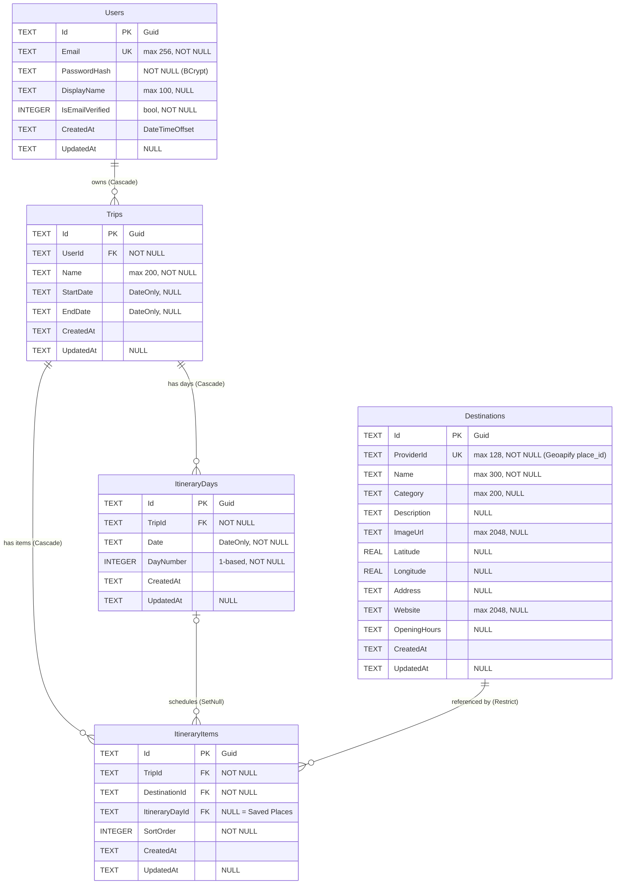

# TripPlanner — Technical Specification & Implementation Reference

> **Scope of this document.** Part A (§1–§10) is reverse-engineered strictly from the
> code present in this repository — it describes what the code *actually does*.
> Part B (§11–§13) is the forward-looking reference for implementing the remaining
> features: full feature specifications (business rules, contracts, algorithms, edge
> cases) and a step-by-step implementation roadmap. An AI or human implementer should
> treat Part A as ground truth about the existing system and Part B as the work order.
> Throughout Part A, statements are tagged:
>
> - **[Observed]** — directly visible in source code, configuration, or migrations.
> - **[Inferred]** — strongly implied by the implementation (e.g. behavior that follows
>   from framework defaults or from how components are wired), but not written as an
>   explicit statement in the code.
>
> The single most important AS-IS fact: **only Feature 4 (Authentication) is
> implemented.** The Trip Planner and Destination services exist as compiling stubs
> whose every method throws `NotImplementedException`, which the middleware translates
> to HTTP **501 Not Implemented**. [Observed]

---

## 1. Project Overview

### 1.1 What the system is

**[Observed]** TripPlanner is a training-capstone template for a travel trip-planning
web application, defined by [ASSIGNMENT.md](ASSIGNMENT.md). The intended product lets
users search destinations, view details, and organize destinations into a day-by-day
trip itinerary. The repository contains:

- A **.NET 10 Web API backend** (`backend/`) structured as a 4-project Clean
  Architecture solution ([TripPlanner.sln](backend/TripPlanner.sln)).
- A **React 19 + TypeScript + Vite frontend** (`frontend/`).
- An xUnit test project covering the Auth service.
- Dev tooling: `start-dev.bat` / `dev.ps1` / `dev.sh` launch scripts and an optional
  PostgreSQL `docker-compose.yml`.

### 1.2 What actually works today

| Feature (per ASSIGNMENT.md) | Backend state | Frontend state |
|---|---|---|
| **F4 — User Authentication** (register, login, logout, JWT) | ✅ Fully implemented ([AuthService.cs](backend/src/TripPlanner.Application/Features/Auth/AuthService.cs), [AuthController.cs](backend/src/TripPlanner.WebApi/Controllers/AuthController.cs)) | ✅ Implemented (LoginPage, RegisterPage, AuthContext, ProtectedRoute) |
| **F1 — Destination Suggestion** (search, attractions) | ❌ Stub — every method throws `NotImplementedException` ([DestinationService.cs](backend/src/TripPlanner.Application/Features/Destinations/DestinationService.cs), [GeoapifyClient.cs](backend/src/TripPlanner.Infrastructure/ExternalApis/GeoapifyClient.cs)) | ❌ Stub placeholder page ([SearchPage.tsx](frontend/src/features/destinations/SearchPage.tsx)) |
| **F2 — Destination Details** | ❌ Stub (`GetDetailsAsync` throws) | ❌ No details view exists |
| **F3 — Trip Planner** (CRUD, itinerary, scheduling) | ❌ Stub — all six `TripService` methods throw ([TripService.cs](backend/src/TripPlanner.Application/Features/Trips/TripService.cs)) | ❌ Stub placeholder page ([TripsPage.tsx](frontend/src/features/trips/TripsPage.tsx)) |
| **F4/US2 — Email verification** | ❌ Not implemented; users are created with `IsEmailVerified = true` ([AuthService.cs:61](backend/src/TripPlanner.Application/Features/Auth/AuthService.cs:61)) | — |

**[Observed]** All routes, DTOs, domain entities, EF Core mappings, the initial database
migration, JWT auth plumbing, exception middleware, DI wiring, and Swagger are fully in
place — the stubs are intentionally wired into DI so the API surface is visible in
Swagger from day one (stated in the `DestinationService` XML doc comment).

### 1.3 Intended behavior (inferred from scaffolding, not implemented)

**[Inferred]** The DTOs, entity comments, and controller routing show the intended
behavior of the unimplemented parts: location autocomplete capped at 5 results,
attractions capped at 20 per page within a default 20 km radius, trips with optional
date ranges generating one `ItineraryDay` per date, an unscheduled "Saved Places"
bucket (`ItineraryItem.ItineraryDayId == null`), per-day ordering via `SortOrder`, and
a no-duplicate-destination-per-day rule. None of this logic exists in executable form;
only the data shapes and DB constraints do.

### 1.4 Scope limitations

- **[Observed]** No email sending, no refresh tokens, no roles/permissions, no caching
  layer, no logging beyond default ASP.NET Core logging, no CI configuration, no
  integration tests (a `public partial class Program` hook exists for
  `WebApplicationFactory`, but no integration test project uses it).
- **[Observed]** The frontend has no API wrappers or TypeScript types for trips or
  destinations ([types.ts](frontend/src/types.ts) contains only `User` and
  `AuthResponse` plus a student TODO).

---

## 2. Existing Code Structure (AS-IS)

### 2.1 Repository layout

```
backend/
  TripPlanner.sln
  Directory.Build.props            # net10.0, nullable enable, implicit usings
  src/
    TripPlanner.Domain/            # entities, DomainException — zero dependencies
    TripPlanner.Application/       # services, DTOs, interfaces, app exceptions
    TripPlanner.Infrastructure/    # EF Core, JWT, BCrypt, Geoapify client, migrations
    TripPlanner.WebApi/            # controllers, middleware, Program.cs, appsettings
  tests/
    TripPlanner.Application.Tests/ # AuthServiceTests only
frontend/
  src/
    api/          # client.ts (axios + JWT interceptor), auth.ts
    auth/         # AuthContext.tsx, ProtectedRoute.tsx
    features/     # auth/ (implemented), destinations/ & trips/ (stub pages)
    types.ts, App.tsx, main.tsx, styles.css
docker-compose.yml  # optional Postgres 17
start-dev.bat / dev.ps1 / dev.sh
```

### 2.2 Project dependency graph

**[Observed]** from `<ProjectReference>` entries in the `.csproj` files:

```
WebApi ──▶ Application ──▶ Domain
   │             ▲
   └──▶ Infrastructure ──┘   (Infrastructure ──▶ Application ──▶ Domain)
```

- `TripPlanner.Domain` references **nothing** (no packages, no projects).
- `TripPlanner.Application` references Domain + `Microsoft.EntityFrameworkCore`
  (for `DbSet<T>` in `IApplicationDbContext`) + DI abstractions.
- `TripPlanner.Infrastructure` references Application; carries EF Core providers
  (SQLite, Npgsql), JWT, BCrypt packages.
- `TripPlanner.WebApi` references Application and Infrastructure; carries
  JwtBearer, EF Design, Swashbuckle.

### 2.3 Where business logic lives

**[Observed]** All implemented business logic sits in the **Application layer**
(`AuthService`), plus one domain method (`Trip.SetDates`) and DB-level constraints
in Infrastructure entity configurations. Controllers are thin pass-throughs: they
bind the request, call one service method, and wrap the result in `Ok(...)` /
`CreatedAtAction(...)` / `NoContent()`. No business logic exists in controllers.

### 2.4 Separation of concerns

**[Observed]** Separation is real, not just cosmetic:

- The Application layer consumes only interfaces it defines itself
  (`IRepository<T>`, `IUnitOfWork`, `IUserRepository`, `ITripRepository`,
  `IDestinationRepository`, `IPasswordHasher`, `IJwtTokenGenerator`,
  `ICurrentUserService`, `IDestinationProvider`); implementations live in
  Infrastructure/WebApi and are bound in DI extension methods
  ([Application/DependencyInjection.cs](backend/src/TripPlanner.Application/DependencyInjection.cs),
  [Infrastructure/DependencyInjection.cs](backend/src/TripPlanner.Infrastructure/DependencyInjection.cs)).
- A generic `IRepository<T>` + `IUnitOfWork` pair, plus per-entity repository
  interfaces for `User`, `Trip`, and `Destination` (see
  [docs/superpowers/specs/2026-07-25-repository-pattern-design.md](docs/superpowers/specs/2026-07-25-repository-pattern-design.md)),
  is the data-access layer services depend on. The Application layer takes no
  package dependency on `Microsoft.EntityFrameworkCore` — a unique-index
  violation surfaces from `IUnitOfWork.SaveChangesAsync` as the EF-agnostic
  `ConcurrencyException`, which services catch and translate into a
  feature-specific `ConflictException`. [Observed]

---

## 3. Functional Behavior (From Code)

### 3.1 Feature 4 — Authentication (IMPLEMENTED)

#### Register (`AuthService.RegisterAsync`)

**Flow [Observed]:**
1. Email is normalized: `Trim().ToLowerInvariant()` ([AuthService.cs:113](backend/src/TripPlanner.Application/Features/Auth/AuthService.cs:113)).
2. Validation: email must be non-blank and contain `'@'`; password must be at least
   **8 characters** (`MinPasswordLength = 8`). Failures accumulate into a
   field→messages dictionary and throw `ValidationException` (→ HTTP 400).
3. Uniqueness check: `Users.AnyAsync(u => u.Email == email)`. If taken, throws
   `ConflictException` (→ 409) with the deliberately generic message
   *"Unable to register with the provided details."* — the comment states this avoids
   account enumeration.
4. User is created with BCrypt password hash, trimmed `DisplayName` (blank → `null`),
   and `IsEmailVerified = true` (explicitly a "template simplification").
5. Saved via `SaveChangesAsync`; a JWT + `UserDto` is returned.

**Edge cases handled [Observed]:** whitespace-only display name → null; mixed-case
email → lowercased (asserted by `AuthServiceTests`).

**Edge cases NOT handled [Observed]:**
- The email check `Contains('@')` accepts strings like `"a@"`; there is no full
  email-format validation.
- Check-then-insert race: two concurrent registrations of the same email could both
  pass `AnyAsync`; the DB unique index on `Users.Email` would then throw a raw
  `DbUpdateException`, which the middleware maps to **500**, not 409. No catch/retry
  exists in `AuthService`. [Inferred from the absence of any `DbUpdateException`
  handling + the unique index in the migration]
- No password complexity rules beyond length; no maximum length; no rate limiting.

#### Login (`AuthService.LoginAsync`)

**Flow [Observed]:** normalize email → `FirstOrDefaultAsync` by email → if user is
missing **or** `BCrypt.Verify` fails, throw `UnauthorizedException("Invalid email or
password.")` (→ 401). The error message is identical for both failure modes
(anti-enumeration, per code comment). On success returns `AuthResponse(AccessToken,
ExpiresAt, UserDto)`.

**Edge case NOT handled [Observed]:** when the user does not exist, no dummy hash
verification is performed — the code comment itself notes it "short-circuits for
clarity", so a timing side-channel between "unknown email" and "wrong password"
exists. `IsEmailVerified` is never checked at login.

#### Logout

**[Observed]** Purely client-side: `AuthContext.logout()` removes the token and user
from `localStorage`. There is no server-side token revocation endpoint; issued JWTs
remain valid until expiry.

#### Session persistence (frontend)

**[Observed]** `AuthContext` stores the JWT under `localStorage["tripplanner.token"]`
and the user object under `localStorage["tripplanner.user"]`. An axios request
interceptor in [client.ts](frontend/src/api/client.ts) attaches
`Authorization: Bearer <token>` to every request when a token exists.
**[Observed gap]** Nothing checks `expiresAt`; an expired token stays in storage and
the UI still treats the user as authenticated until an API call returns 401 — and
there is no 401 response interceptor to force logout.

### 3.2 Feature 1 & 2 — Destinations (STUB)

**[Observed]** `DestinationService.SearchLocationsAsync`, `GetAttractionsAsync`, and
`GetDetailsAsync` each immediately throw `NotImplementedException` with a message
pointing at the assignment user story. `GeoapifyClient` (the `IDestinationProvider`
implementation) likewise throws from all three methods. Calling any
`/api/destinations/*` endpoint therefore returns **501 Not Implemented** with a
ProblemDetails body. No query validation, no result capping, no caching exists —
these are TODO comments only.

### 3.3 Feature 3 — Trips (STUB)

**[Observed]** All six `TripService` methods (`GetMyTripsAsync`, `GetTripAsync`,
`CreateTripAsync`, `UpdateTripAsync`, `AddDestinationAsync`,
`RemoveDestinationAsync`) throw `NotImplementedException`. Every `/api/trips`
endpoint returns **401** without a valid JWT (controller-level `[Authorize]`) or
**501** with one.

**[Observed]** The only executable Feature-3 business rule is
`Trip.SetDates(startDate, endDate)` in the Domain layer, which throws
`DomainException` when both dates are set and `start > end`
([Trip.cs:29](backend/src/TripPlanner.Domain/Entities/Trip.cs:29)). Nothing currently
calls it (the intended caller, `TripService.UpdateTripAsync`, is a stub).

---

## 4. API Specification (Actual Implementation Only)

All endpoints are attribute-routed controllers under `api/[controller]`.
All error responses are `application/problem+json` (RFC 7807 `ProblemDetails`)
produced by [ExceptionHandlingMiddleware](backend/src/TripPlanner.WebApi/Middleware/ExceptionHandlingMiddleware.cs). [Observed]

### 4.1 AuthController — `api/auth` (anonymous, fully functional)

| Route | Method | Request body | Success response | Error responses |
|---|---|---|---|---|
| `/api/auth/register` | POST | `RegisterRequest { email: string, password: string, displayName?: string }` | **200 OK** `AuthResponse { accessToken, expiresAt, user: { id, email, displayName } }` | **400** validation (bad email / password < 8 chars, with `errors` dictionary extension); **409** email already registered |
| `/api/auth/login` | POST | `LoginRequest { email: string, password: string }` | **200 OK** `AuthResponse` (same shape) | **401** "Invalid email or password." |

Notes [Observed]:
- Register returns **200**, not 201 (`Ok(response)` in the controller; the
  `ProducesResponseType` attributes match).
- `[ApiController]` is present, so ASP.NET Core's automatic model-state validation
  applies to request binding; however the request DTOs carry **no DataAnnotations**,
  so in practice only malformed JSON / type mismatches produce the framework's
  automatic 400. [Inferred from `[ApiController]` + absence of annotations]

### 4.2 DestinationsController — `api/destinations` (anonymous, stubbed)

| Route | Method | Parameters | AS-IS response |
|---|---|---|---|
| `/api/destinations/locations` | GET | `query` (string, from query) | **501** ProblemDetails "Not implemented yet" |
| `/api/destinations/attractions` | GET | `lat` (double), `lng` (double), `radiusKm` (double, default **20**) | **501** |
| `/api/destinations/{providerId}` | GET | `providerId` (string, route) | **501** |

Declared (unreachable) success types: `IReadOnlyList<LocationSuggestionDto>`,
`IReadOnlyList<DestinationSummaryDto>`, `DestinationDetailsDto`. No `[Authorize]` —
the controller comment says these are deliberately public so users can browse before
logging in. [Observed]

### 4.3 TripsController — `api/trips` (`[Authorize]` on the controller, stubbed)

| Route | Method | Request | AS-IS response (with valid JWT) |
|---|---|---|---|
| `/api/trips` | GET | — | **501** |
| `/api/trips/{tripId:guid}` | GET | — | **501** |
| `/api/trips` | POST | `CreateTripRequest { name }` | **501** (would be **201 CreatedAtAction** if implemented — the controller already wraps the result) |
| `/api/trips/{tripId:guid}` | PUT | `UpdateTripRequest { name, startDate?, endDate? }` | **501** |
| `/api/trips/{tripId:guid}/destinations` | POST | `AddDestinationRequest { providerId, itineraryDayId? }` | **501** |
| `/api/trips/{tripId:guid}/destinations/{itemId:guid}` | DELETE | — | **501** (would be **204 NoContent**) |

Without a valid JWT every route returns **401** (JWT bearer default challenge).
Non-GUID `tripId`/`itemId` values fail the `:guid` route constraint → **404**.
[Inferred from routing constraints + JwtBearer defaults]

### 4.4 Cross-cutting HTTP behavior

- **CORS [Observed]:** policy `AllowFrontend` allows origins from
  `Cors:AllowedOrigins` (default `http://localhost:5173`), any header, any method.
- **Swagger [Observed]:** `/swagger` in Development only, with a Bearer "Authorize"
  button.
- **HTTPS redirection is absent** — the pipeline has no `UseHttpsRedirection()`;
  the API serves plain HTTP on `http://localhost:5080`. [Observed]

---

## 5. Data Model (Actual Code Representation)

### 5.1 Domain entities (all in `TripPlanner.Domain/Entities`, no framework dependencies)

All entities inherit [BaseEntity](backend/src/TripPlanner.Domain/Common/BaseEntity.cs):
`Guid Id` (client-generated via `Guid.NewGuid()`), `DateTimeOffset CreatedAt`
(defaulted to `UtcNow` in code, not the DB), `DateTimeOffset? UpdatedAt`. [Observed]

| Entity | Fields | Relationships |
|---|---|---|
| `User` | `Email` (required), `PasswordHash` (required), `DisplayName?`, `IsEmailVerified` | 1 → many `Trips` |
| `Trip` | `UserId`, `Name` (required), `StartDate?`, `EndDate?` (`DateOnly?`) | many → 1 `User`; 1 → many `Days`, 1 → many `Items`. Method: `SetDates` (start ≤ end rule) |
| `ItineraryDay` | `TripId`, `Date` (`DateOnly`), `DayNumber` (1-based, per comment) | many → 1 `Trip`; 1 → many `Items` |
| `ItineraryItem` | `TripId`, `DestinationId`, `ItineraryDayId?` (**null = "Saved Places" bucket**, per comment), `SortOrder` | many → 1 `Trip`, `Destination`, `ItineraryDay?` |
| `Destination` | `ProviderId` (required — external provider's stable id, e.g. Geoapify `place_id`), `Name` (required), `Category?`, `Description?`, `ImageUrl?`, `Latitude?`, `Longitude?`, `Address?`, `Website?`, `OpeningHours?` | referenced by `ItineraryItem`; comment describes it as a local cache of provider data |

There are **no value objects, no enums, no domain events, and no aggregate-root
enforcement** — entities are mutable classes with public setters. [Observed]

### 5.2 DTOs (Application layer, C# records)

- **Auth:** `RegisterRequest`, `LoginRequest`, `UserDto`, `AuthResponse` — the
  password hash never appears in any DTO. [Observed]
- **Destinations:** `LocationSuggestionDto`, `DestinationSummaryDto` (includes
  `Rating` — a field that does **not** exist on the `Destination` entity),
  `DestinationDetailsDto`.
- **Trips:** `CreateTripRequest`, `UpdateTripRequest`, `AddDestinationRequest`,
  `TripSummaryDto` (with computed `DestinationCount`), `TripDestinationDto`,
  `ItineraryDayDto`, `TripDetailDto` (days + separate `SavedPlaces` list).

Mapping is manual (constructor calls in `AuthService`); no AutoMapper. [Observed]

### 5.3 Frontend types

**[Observed]** Only `User` and `AuthResponse` exist in
[types.ts](frontend/src/types.ts); trip/destination types are an explicit student TODO.

---

## 6. Business Logic (Extracted from Code)

### 6.1 Explicit, executable rules

| # | Rule | Where enforced | HTTP effect |
|---|---|---|---|
| B1 | Password ≥ 8 characters | `AuthService.ValidateRegistration` (constant `MinPasswordLength`) | 400 |
| B2 | Email must be non-blank and contain `@` | same | 400 |
| B3 | Emails are stored/compared lowercase + trimmed | `AuthService.NormalizeEmail` | — |
| B4 | Email must be unique | `AuthService` pre-check (409) **and** unique DB index `IX_Users_Email` | 409 (app) / 500 (index race, unhandled) |
| B5 | Auth failure messages never reveal whether an account exists | generic messages in Register (409) and Login (401) | — |
| B6 | Passwords stored only as BCrypt hashes (salt embedded) | `BCryptPasswordHasher` | — |
| B7 | Trip start date must be ≤ end date (when both set) | `Trip.SetDates` throws `DomainException` | 400 — **currently unreachable** (no caller) |
| B8 | A destination cannot appear twice in the same itinerary day | unique DB index `IX_ItineraryItems_ItineraryDayId_DestinationId` | DB-level only; no app-level handling exists |
| B9 | One cached `Destination` row per external place | unique DB index `IX_Destinations_ProviderId` | DB-level only |
| B10 | Deleting a user cascades to trips; deleting a trip cascades to its days and items | FK delete behaviors (Cascade) | — |
| B11 | Deleting an itinerary day returns its items to "Saved Places" (FK set to NULL), it does not delete them | `ItineraryDayConfiguration` `DeleteBehavior.SetNull` | — |
| B12 | A `Destination` cannot be deleted while referenced by any itinerary item | `DeleteBehavior.Restrict` on `ItineraryItem.DestinationId` | — |
| B13 | `UpdatedAt` is stamped automatically on modified entities at save time | `ApplicationDbContext.SaveChangesAsync` override | — |
| B14 | JWT tokens expire after `Jwt:ExpiryMinutes` (config default 60) with zero clock skew | `JwtTokenGenerator` + `TokenValidationParameters.ClockSkew = TimeSpan.Zero` | 401 after expiry |
| B15 | Users are created already email-verified | `IsEmailVerified = true` in `RegisterAsync` | — |

### 6.2 Inferred behavior

- **[Inferred]** B8/B9/B11/B12 exist *only* as database constraints; since the services
  that would exercise them are stubs, violating them via future code would surface as
  an unhandled `DbUpdateException` → HTTP 500 under the current middleware mapping.
- **[Inferred]** The per-user authorization rule ("users only see their own trips",
  NFR 6) is *declared* in interface/entity comments and supported by `ICurrentUserService`,
  but no executable filter exists anywhere — it is a contract for future code, not a rule
  the system currently enforces beyond the `[Authorize]` attribute.
- **[Inferred]** `ICurrentUserService.IsAuthenticated` is a default interface member
  (`UserId is not null`); `CurrentUserService` reads the user id from the
  `ClaimTypes.NameIdentifier` claim first, falling back to the raw `"sub"` claim —
  the fallback exists because the JWT handler's default inbound claim mapping renames
  `sub` to `ClaimTypes.NameIdentifier`.

---

## 7. Validation Rules (Actual Implementation)

**Validation layers actually present, in pipeline order:** [Observed]

1. **Route constraints** — `{tripId:guid}`, `{itemId:guid}` (mismatch → 404).
2. **`[ApiController]` automatic model-state validation** — catches malformed
   JSON/unbindable values only, because **no DataAnnotations exist on any DTO**.
   (The `required` properties on entities are C# compile-time `required` modifiers,
   not validation attributes.)
3. **Manual service-layer validation** — the only substantive validation in the
   system: `AuthService.ValidateRegistration` (email shape, password length) throwing
   `ValidationException` with a field-error dictionary.
4. **Domain validation** — `Trip.SetDates` (currently uncalled).
5. **Database constraints** — required columns, max lengths (`Email` 256,
   `DisplayName` 100, `Trip.Name` 200, `Destination.ProviderId` 128 / `Name` 300 /
   `Category` 200 / `ImageUrl` & `Website` 2048), unique indexes (B4, B8, B9),
   FK delete behaviors.

**Not present [Observed]:** FluentValidation, action filters, custom model binders,
any validation on `LoginRequest`, `CreateTripRequest`, `UpdateTripRequest`,
`AddDestinationRequest`, or on destination query parameters.

**Frontend validation [Observed]:** HTML-native only — `type="email"`, `required`,
and `minLength={8}` on the register password input.

---

## 8. Database Layer

### 8.1 DbContext

**[Observed]** [ApplicationDbContext](backend/src/TripPlanner.Infrastructure/Persistence/ApplicationDbContext.cs)
implements `IApplicationDbContext`; exposes `DbSet`s for `Users`, `Trips`,
`ItineraryDays`, `Destinations`, `ItineraryItems`; applies all
`IEntityTypeConfiguration<T>` classes from its assembly; overrides `SaveChangesAsync`
to stamp `UpdatedAt` on modified `BaseEntity` rows. Note: only the `Modified` state is
handled — `CreatedAt` comes from the C# property initializer, not the DbContext.

### 8.2 Provider strategy

**[Observed]** `Database:Provider` config switch: `"Sqlite"` (default; connection
string `Data Source=tripplanner.db`, also hard-coded as a fallback) or `"Postgres"`
(Npgsql; docker-compose supplies Postgres 17 with user/password/db `tripplanner`).

### 8.3 Entity-relationship diagram

**[Observed]** All tables, keys, and relationships below come from the single
migration [20260612055321_InitialCreate.cs](backend/src/TripPlanner.Infrastructure/Migrations/20260612055321_InitialCreate.cs)
and the entity configurations in
[Persistence/Configurations](backend/src/TripPlanner.Infrastructure/Persistence/Configurations).



Column types shown are the **SQLite** affinities generated by the migration
(`Guid`/`DateTimeOffset`/`DateOnly`/strings → `TEXT`, `bool`/`int` → `INTEGER`,
`double` → `REAL`). Under the optional Npgsql provider the same model would map to
native `uuid`/`timestamptz`/`date` types, but no Postgres migration exists in the
repository. [Observed / Inferred]

### 8.4 Tables in detail

Every table shares the [BaseEntity](backend/src/TripPlanner.Domain/Common/BaseEntity.cs)
columns: `Id` (Guid, PK, generated **client-side** via `Guid.NewGuid()` — not a DB
default), `CreatedAt` (set in C# at construction), `UpdatedAt` (stamped by the
`SaveChangesAsync` override on modification). [Observed]

#### `Users`

| Column | Type (SQLite) | Nullable | Constraint |
|---|---|---|---|
| `Id` | TEXT | no | PK |
| `Email` | TEXT (256) | no | **UNIQUE** (`IX_Users_Email`) |
| `PasswordHash` | TEXT | no | BCrypt hash, salt embedded |
| `DisplayName` | TEXT (100) | yes | |
| `IsEmailVerified` | INTEGER | no | always `true` as written today |
| `CreatedAt` / `UpdatedAt` | TEXT | no / yes | |

#### `Trips`

| Column | Type | Nullable | Constraint |
|---|---|---|---|
| `Id` | TEXT | no | PK |
| `UserId` | TEXT | no | FK → `Users.Id`, **ON DELETE CASCADE**; indexed (`IX_Trips_UserId`) |
| `Name` | TEXT (200) | no | |
| `StartDate` / `EndDate` | TEXT (DateOnly) | yes | start ≤ end enforced only in C# (`Trip.SetDates`), **not** by a DB check constraint |
| `CreatedAt` / `UpdatedAt` | TEXT | no / yes | |

#### `ItineraryDays`

| Column | Type | Nullable | Constraint |
|---|---|---|---|
| `Id` | TEXT | no | PK |
| `TripId` | TEXT | no | FK → `Trips.Id`, **ON DELETE CASCADE**; indexed (`IX_ItineraryDays_TripId`) |
| `Date` | TEXT (DateOnly) | no | no uniqueness — nothing stops two day rows with the same date in one trip [Observed gap] |
| `DayNumber` | INTEGER | no | 1-based display number (per entity comment); not constrained |
| `CreatedAt` / `UpdatedAt` | TEXT | no / yes | |

#### `Destinations` (cache of external-provider data)

| Column | Type | Nullable | Constraint |
|---|---|---|---|
| `Id` | TEXT | no | PK (internal Guid, distinct from the provider's id) |
| `ProviderId` | TEXT (128) | no | **UNIQUE** (`IX_Destinations_ProviderId`) — one row per external place |
| `Name` | TEXT (300) | no | |
| `Category` | TEXT (200) | yes | |
| `Description` | TEXT | yes | |
| `ImageUrl` | TEXT (2048) | yes | |
| `Latitude` / `Longitude` | REAL | yes | |
| `Address` | TEXT | yes | |
| `Website` | TEXT (2048) | yes | |
| `OpeningHours` | TEXT | yes | free-text, not structured |
| `CreatedAt` / `UpdatedAt` | TEXT | no / yes | |

Note the entity/DTO mismatch: `DestinationSummaryDto` exposes a `Rating`, but no
rating column exists — ratings would come straight from the provider response and are
never persisted. [Observed]

#### `ItineraryItems` (join table: destination ∈ trip, optionally scheduled into a day)

| Column | Type | Nullable | Constraint |
|---|---|---|---|
| `Id` | TEXT | no | PK |
| `TripId` | TEXT | no | FK → `Trips.Id`, **CASCADE**; indexed |
| `DestinationId` | TEXT | no | FK → `Destinations.Id`, **RESTRICT** (a destination in use cannot be deleted); indexed |
| `ItineraryDayId` | TEXT | yes | FK → `ItineraryDays.Id`, **SET NULL** (deleting a day returns its items to Saved Places). `NULL` = the "Saved Places" bucket |
| `SortOrder` | INTEGER | no | visit sequence within a day/bucket; **no unique index** — duplicate sort values are possible |
| `CreatedAt` / `UpdatedAt` | TEXT | no / yes | |

**Unique index:** `IX_ItineraryItems_ItineraryDayId_DestinationId` — a destination may
appear at most once *per scheduled day*. Because `ItineraryDayId` is nullable and SQL
treats NULLs as distinct in unique indexes, the Saved Places bucket (`NULL`) may hold
the same destination multiple times. [Observed / Inferred]

### 8.5 Migrations, seeding, provider notes

**[Observed]** `20260612055321_InitialCreate` is the only migration; it creates all
five tables and seven indexes, and its `Down` drops them. There is no seed data.
Migrations are applied automatically at startup by `ApplyMigrationsAsync` in
[Program.cs:115](backend/src/TripPlanner.WebApi/Program.cs:115) (only when pending
migrations exist). The migration was scaffolded against SQLite; docker-compose
comments note that switching to Postgres requires re-creating migrations for that
provider.

---

## 9. Architecture Assessment (Descriptive Only)

- **[Observed]** The solution is a textbook 4-project Clean Architecture layout with
  correct dependency direction (Domain ← Application ← Infrastructure; WebApi as
  composition root referencing both). Each layer's `.csproj` carries an explanatory
  comment stating its rules, and the code respects them: Domain has zero references;
  Application depends on its own interfaces; Infrastructure implements them.
- **[Observed]** Dependency Inversion is applied consistently: all five cross-layer
  contracts (`IApplicationDbContext`, `IPasswordHasher`, `IJwtTokenGenerator`,
  `ICurrentUserService`, `IDestinationProvider`) are declared in Application and
  implemented in outer layers.
- **[Observed]** Pragmatic deviations, documented in-code as deliberate choices:
  (1) Application references the EF Core package to expose `DbSet<T>` — services query
  EF directly rather than through repositories; (2) no CQRS/MediatR — plain service
  interfaces per feature ("feature folder" organization:
  `Application/Features/{Auth,Destinations,Trips}` each with service, interface,
  `Dtos/`); (3) manual DTO mapping.
- **[Observed]** Controllers are uniformly thin; error handling is centralized in one
  middleware; DI composition is split into per-layer extension methods so
  `Program.cs` stays a readable pipeline description.
- **[Observed]** Cohesion is high (one feature per folder in both backend and
  frontend); coupling between layers is limited to the interfaces above. The test
  project references Infrastructure (for `ApplicationDbContext`,
  `BCryptPasswordHasher`) even though it is named `Application.Tests`.
- **[Observed]** The codebase is explicitly a teaching template: XML doc comments
  label the Auth slice as "REFERENCE IMPLEMENTATION" and the other services as
  "STUB — students implement this", with per-method TODOs keyed to assignment user
  stories.

### DI registrations (complete list) [Observed]

| Service | Implementation | Lifetime | Registered in |
|---|---|---|---|
| `IAuthService` | `AuthService` | Scoped | Application |
| `ITripService` | `TripService` (stub) | Scoped | Application |
| `IDestinationService` | `DestinationService` (stub) | Scoped | Application |
| `ApplicationDbContext` / `IApplicationDbContext` | same instance (factory forward) | Scoped | Infrastructure |
| `IPasswordHasher` | `BCryptPasswordHasher` | Scoped | Infrastructure |
| `IJwtTokenGenerator` | `JwtTokenGenerator` | Scoped | Infrastructure |
| `IDestinationProvider` | `GeoapifyClient` | Typed `HttpClient` (transient + `IHttpClientFactory`) | Infrastructure |
| `IOptions<JwtSettings>` | bound to `"Jwt"` section | Singleton options | Infrastructure |
| `ICurrentUserService` | `CurrentUserService` (+ `AddHttpContextAccessor`) | Scoped | WebApi (`Program.cs`) |

### Request pipeline order [Observed, Program.cs]

`ExceptionHandlingMiddleware` → Swagger (Dev only) → CORS → Authentication →
Authorization → controller routing. Exception middleware is outermost, so every
exception from any later stage is converted to ProblemDetails.

### Authentication details [Observed]

- Scheme: JWT Bearer (symmetric HMAC-SHA256).
- Token claims: `sub` (user id), `email`, `jti`; issuer/audience/lifetime/signing-key
  all validated; `ClockSkew = 0`.
- Config: `Jwt` section — Issuer `TripPlanner`, Audience `TripPlannerClient`,
  60-minute expiry, and a **development signing key committed to appsettings.json**
  (`"CHANGE_ME_dev_only_signing_key_min_32_chars_long!"`).
- Authorization: the single `[Authorize]` attribute on `TripsController`. No roles,
  no policies, no claims-based rules anywhere.

### Error-handling contract [Observed, ExceptionHandlingMiddleware]

| Exception | Status | Title |
|---|---|---|
| `ValidationException` | 400 | "Validation failed" (+ `errors` dictionary in extensions) |
| `DomainException` | 400 | "Business rule violated" |
| `UnauthorizedException` | 401 | "Authentication failed" |
| `NotFoundException` | 404 | "Resource not found" |
| `ConflictException` | 409 | "Conflict" |
| `NotImplementedException` | 501 | "Not implemented yet" |
| anything else | 500 | "An unexpected error occurred" (logged via `ILogger.LogError`; 500 is the only logged case) |

The exception `Message` is always copied into `ProblemDetails.Detail`, including for
500s — internal exception messages are exposed to clients. [Observed]

### Testing [Observed]

One test class, [AuthServiceTests](backend/tests/TripPlanner.Application.Tests/Auth/AuthServiceTests.cs):
5 tests covering register (success/duplicate/short password) and login
(success/wrong password). Pattern: fresh EF InMemory database per test
(`Guid.NewGuid()` database name), real `BCryptPasswordHasher`, Moq-faked
`IJwtTokenGenerator`. Note the InMemory provider does not enforce the unique
indexes or FK behaviors described in §8. No tests exist for Trip or Destination
services (they are stubs), and no integration tests exist despite the
`public partial class Program` hook.

---

## 10. External Dependencies

### Backend NuGet packages [Observed from .csproj files]

| Package | Version | Used by | Purpose |
|---|---|---|---|
| Microsoft.EntityFrameworkCore | 10.0.9 | Application, Infrastructure | ORM core / `DbSet<T>` in the Application contract |
| Microsoft.EntityFrameworkCore.Sqlite | 10.0.9 | Infrastructure | default DB provider |
| Npgsql.EntityFrameworkCore.PostgreSQL | 10.0.2 | Infrastructure | optional Postgres provider |
| Microsoft.EntityFrameworkCore.Design | 10.0.9 | Infrastructure, WebApi | `dotnet ef` tooling |
| System.IdentityModel.Tokens.Jwt | 8.19.1 | Infrastructure | JWT creation |
| System.Security.Cryptography.Xml | 10.0.9 | Infrastructure | (transitive-pin; no direct usage found in code) |
| BCrypt.Net-Next | 4.0.3 | Infrastructure | password hashing |
| Microsoft.Extensions.Http / Options / Configuration.Abstractions / DI.Abstractions | 10.0.9 | Application/Infrastructure | HttpClientFactory, options pattern, DI |
| Microsoft.AspNetCore.Authentication.JwtBearer | 10.0.9 | WebApi | JWT validation |
| Swashbuckle.AspNetCore | 7.2.0 | WebApi | Swagger/OpenAPI |
| Microsoft.NET.Test.Sdk 17.12.0, xunit 2.9.2, xunit.runner.visualstudio 2.8.2, EFCore.InMemory 10.0.9, Moq 4.20.72 | — | Tests | test stack |

### Frontend npm packages [Observed from package.json]

`react` 19, `react-dom` 19, `react-router-dom` 7, `axios` 1.7; dev: `vite` 6,
`typescript` 5.7, `@vitejs/plugin-react`. No ESLint (`npm run lint` is `tsc --noEmit`).

### Third-party services

- **Geoapify** (https://apidocs.geoapify.com/docs) — configured (`Geoapify:BaseUrl` =
  `https://api.geoapify.com/`, empty `ApiKey` placeholder) and wired
  as a typed HttpClient, but **never actually called** because the client is a stub.
  [Observed]
- **PostgreSQL via Docker** — optional, off by default. [Observed]
- No cache, message queue, email provider, or file storage exists. [Observed]

### Configuration summary [Observed, appsettings.json]

`Logging` (EF command logging at Warning), `AllowedHosts: *`,
`Database:Provider = Sqlite`, connection strings for Sqlite + Postgres,
`Jwt` (issuer/audience/key/expiry), `Cors:AllowedOrigins`, `Geoapify`
(base URL + empty API key). `appsettings.Development.json` only raises ASP.NET Core
log verbosity. Secrets management: none — the JWT dev key and Postgres password are
committed in plain text; put the Geoapify key
in `appsettings.Development.json`. Frontend: `VITE_API_BASE_URL` env var (read in
`client.ts`, default `http://localhost:5080/api`).

---

# Part B — Feature Specifications & Implementation Roadmap

Everything below is the **to-build** specification, derived from
[ASSIGNMENT.md](ASSIGNMENT.md) acceptance criteria, the DTO/entity/route contracts
already scaffolded in the code (Part A), and design decisions recorded in this
document. Where a rule is not stated by the assignment or the scaffolding, it is
marked **[Design decision]** — a choice made here so implementers don't have to
re-derive it. Interfaces, DTOs, routes, and the DB schema already exist; implement
**inside** those contracts. Only F3 US4–US6 require adding a new endpoint.

## 11. Feature Specifications

### 11.0 Global rules (apply to every feature)

1. **Blueprint:** follow the structure of [AuthService.cs](backend/src/TripPlanner.Application/Features/Auth/AuthService.cs) —
   validate → enforce rules → query via `IApplicationDbContext` → map to DTO manually.
   Controllers stay thin; never add try/catch or business logic to them.
2. **Errors:** signal outcomes by throwing the Application/Domain exceptions from
   §6/§9's mapping table (`ValidationException` 400, `DomainException` 400,
   `UnauthorizedException` 401, `NotFoundException` 404, `ConflictException` 409).
   The middleware does the rest.
3. **Ownership (NFR6):** every `TripService` method starts by resolving
   `_currentUser.UserId` (throw `UnauthorizedException` if null — belt-and-braces
   under `[Authorize]`) and filters **every** query by it.
   **[Design decision]** A trip that exists but belongs to another user throws
   `NotFoundException`, not 403 — do not leak resource existence.
4. **Unique-index races:** any read-then-write against a unique index
   (`Destinations.ProviderId`, `(ItineraryDayId, DestinationId)`) must catch
   `DbUpdateException`, then re-fetch or convert to `ConflictException`. The EF
   InMemory test provider does **not** enforce these indexes (§9), so this path must
   be correct by construction, not by test.
5. **Provider isolation:** all Geoapify-specific knowledge (URL shapes, response
   JSON, category vocabulary like `tourism.sights`) stays inside `GeoapifyClient`.
   Application code sees only `IDestinationProvider` and the public DTOs.
6. **Caching vs persistence** (decided in this spec, §11.2): browse-path data
   (search, attractions, details) is cached **in memory with a TTL, never persisted**;
   a `Destination` row is written to the DB **only** when a user adds the place to a
   trip (upsert by `ProviderId`). Do not add a "must already exist in DB" check to
   search/details; do not persist search results.
7. **Definition of done per feature** (from ASSIGNMENT.md): acceptance criteria met;
   rules in Application/Domain (not controllers); user-filtered queries; ≥1 unit test
   per new service behavior following the [AuthServiceTests](backend/tests/TripPlanner.Application.Tests/Auth/AuthServiceTests.cs)
   pattern; UI handles loading/empty/error states.

---

### 11.1 Feature 3 — Trip Planner (`TripService`) — build FIRST

**Business goal:** an authenticated user maintains trips; each trip has an optional
date range that materializes as one `ItineraryDay` per date; destinations attach to a
trip either unscheduled ("Saved Places", `ItineraryItem.ItineraryDayId = null`) or
scheduled into a day, ordered by `SortOrder`.

**Why first:** pure backend logic against the local DB — no external API key needed;
the domain model, routes, and DTOs are 100% scaffolded; it unblocks the frontend trips
UI. (`AddDestinationAsync` is the one method with a provider dependency — see below
for how to sequence it.)

#### `GetMyTripsAsync` → `IReadOnlyList<TripSummaryDto>` (US10)

- Query: `Trips` where `UserId == current`, ordered by `CreatedAt` descending
  **[Design decision]**; project to `TripSummaryDto` with
  `DestinationCount = trip.Items.Count` (use a projection so EF translates the count —
  do not load items).
- Empty list is a normal result, not an error.

#### `GetTripAsync(tripId)` → `TripDetailDto` (US10)

- Load the trip where `Id == tripId && UserId == current`, including
  `Days` → `Items` → `Destination` and the unscheduled `Items` → `Destination`.
  Missing → `NotFoundException` (also for other users' trips, rule 11.0-3).
- Mapping: `Days` ordered by `DayNumber`, each day's destinations ordered by
  `SortOrder`; `SavedPlaces` = items with `ItineraryDayId == null` ordered by
  `SortOrder`. `TripDestinationDto.ItemId` is the `ItineraryItem.Id` (the handle the
  client uses to remove/move), `ProviderId`/`Name`/`ImageUrl` come from the joined
  `Destination`.

#### `CreateTripAsync(CreateTripRequest)` → `TripSummaryDto` (US1)

- Validate: `Name` non-blank after trim → else `ValidationException` keyed on
  `nameof(CreateTripRequest.Name)`; enforce ≤ 200 chars (the DB column limit) at
  validation time **[Design decision]**.
- Create `Trip { UserId = current, Name = trimmed }`, save, return summary with
  `DestinationCount = 0`. Controller already returns 201 `CreatedAtAction`.

#### `UpdateTripAsync(tripId, UpdateTripRequest)` → `TripDetailDto` (US2 + rename)

- Load owned trip including `Days`; not found → `NotFoundException`.
- Validate name as in Create. Call **`trip.SetDates(start, end)`** — the existing
  domain method throws `DomainException` (→ 400) when `start > end`. Do not
  reimplement the rule.
- **Day regeneration algorithm** (the core of US2) **[Design decision, constrained by
  the schema's `SetNull` behavior]**:
  1. Target set = every date from `StartDate` to `EndDate` inclusive; empty when
     either date is null.
  2. **Keep** existing `ItineraryDay` rows whose `Date` is in the target set —
     preserving their scheduled items (users must not lose work when extending a
     trip).
  3. **Delete** day rows whose `Date` falls outside the new range — their items
     return to Saved Places automatically (FK `SetNull`, §8.4). When deleting via
     tracked entities, also null the in-memory `ItineraryDayId` of affected items so
     the returned DTO is consistent without a re-query.
  4. **Create** day rows for dates in the target set with no existing row.
  5. Renumber `DayNumber` = 1..n in ascending date order across all remaining days.
- Save once; return the full `TripDetailDto` (re-mapped as in `GetTripAsync`).
- Edge cases: shrinking a range mid-trip; clearing both dates (all days deleted, all
  items back to Saved Places); same range twice (no-op, days preserved). Guard
  against absurd ranges — **[Design decision]** reject ranges > 365 days with
  `ValidationException`.

#### `AddDestinationAsync(tripId, AddDestinationRequest)` → `TripDestinationDto` (US3)

Request carries only `ProviderId` + optional `ItineraryDayId`. Algorithm:

1. Load owned trip (with `Items`) or `NotFoundException`.
2. If `ItineraryDayId` is set: the day must exist **and belong to this trip**, else
   `ValidationException` **[Design decision]**.
3. **Upsert the `Destination` cache row** (§11.0-6): query `Destinations` by
   `ProviderId`; if missing, call `IDestinationProvider.GetDestinationDetailsAsync`
   (null result → `NotFoundException("Destination", providerId)`), map to a new
   `Destination` entity, insert. Wrap the insert's save in a
   `catch (DbUpdateException)` → re-query by `ProviderId` (concurrent add won the
   race). A fresh, never-seen `ProviderId` is the **normal case** — never 404 just
   because the row isn't cached yet.
4. **Duplicate rule (US4/US6):** if the target is a concrete day and an item with the
   same `DestinationId` already exists in that day → `ConflictException`. The unique
   index backs this; the NULL bucket permits duplicates at DB level, so
   **[Design decision]** also reject duplicates in Saved Places at app level for a
   sane UX.
5. `SortOrder` = (max `SortOrder` among items in the same bucket/day) + 1, or 0 when
   empty.
6. Save (with the rule-4 `DbUpdateException` → `ConflictException` catch); return the
   `TripDestinationDto`.

Sequencing note: to build this **before** Feature 1, implement only
`GeoapifyClient.GetDestinationDetailsAsync` early, or test with a mocked
`IDestinationProvider` — the interface is the seam.

#### `RemoveDestinationAsync(tripId, itemId)` (US7)

- Find the item where `Id == itemId && TripId == tripId` and the trip is owned by the
  current user; missing → `NotFoundException`. Remove, save. Controller returns 204.
- **[Design decision]** Do not compact `SortOrder` gaps on removal; ordering is
  relative, gaps are harmless.
- The confirmation dialog required by US7 is frontend-only.

#### US4/US5/US6 — schedule, reorder, move (requires ONE new endpoint)

No route exists for mutating an item. **[Design decision]** Add:

```
PUT /api/trips/{tripId:guid}/destinations/{itemId:guid}
Body: UpdateItineraryItemRequest(Guid? ItineraryDayId, int SortOrder)
→ 200 TripDestinationDto
```

- `ItineraryDayId = null` ⇒ move to Saved Places; non-null ⇒ target day must belong
  to the trip (rule as in Add).
- Duplicate rule applies to the **target** day (moving within the same day is exempt).
- Reorder semantics: the client sends the item's desired position; the service
  resequences the affected bucket(s) — shift items ≥ target position up by one, then
  renumber 0..n to keep values dense. Single `SaveChangesAsync`.
- Add matching `ITripService.UpdateItineraryItemAsync` + controller action; this is
  the only intended change to the scaffolded public contracts.
- NFR4 (DnD ≤ 100 ms) is met client-side with optimistic updates; the API call
  confirms in the background and rolls back UI state on error.

#### Tests (Phase 1 exit criteria)

Mock `ICurrentUserService` (fixed Guid) and `IDestinationProvider`; real InMemory
context per test. Minimum set: create-trip validation (blank name), get-trips filters
by owner (seed two users' trips), get-trip of another user → NotFound, SetDates
inverted range → DomainException, day regeneration keeps in-range days & renumbers,
add-destination upserts vs reuses cache row, duplicate-in-day → Conflict, remove →
gone. Remember: unique indexes and `SetNull` do **not** fire on InMemory — test the
app-level rule, and reason the DB-level path by review.

---

### 11.2 Feature 1 — Destination Suggestion (`DestinationService` + `GeoapifyClient`)

**Business goal:** anonymous users type a city/country, get up to 5 suggestions, pick
one, and see up to 20 recommended attractions nearby.

#### `GeoapifyClient` (Infrastructure)

Provider: **Geoapify** (https://apidocs.geoapify.com/docs). Base address is already
configured in DI (`https://api.geoapify.com/`); relative URLs below.

- Inject the API key from configuration (`Geoapify:ApiKey`) via constructor
  (`IConfiguration` or an options class) — never hard-code. Every request appends
  `&apiKey={key}` as a query parameter.
- Endpoint mapping (verified against the Geoapify docs; re-check parameter details
  at implementation time):
  - `SearchLocationsAsync` → `v1/geocode/autocomplete?text={query}&type=city&limit=5&apiKey={key}`
    (Geocoding API; `type=city` restricts suggestions to cities — drop or widen it if
    country-level results are wanted). Response features carry `city`/`name`,
    `country`, `lat`, `lon` → map to `LocationSuggestionDto`.
  - `GetAttractionsAsync` → `v2/places?categories=tourism.sights,tourism.attraction&filter=circle:{lon},{lat},{radiusMeters}&limit=20&apiKey={key}`
    (Places API). **Careful:** the circle filter is `lon,lat` — longitude FIRST —
    and the radius is in **meters** (`radiusKm * 1000`).
  - `GetDestinationDetailsAsync` → `v2/place-details?id={providerId}&apiKey={key}`
    (Place Details API; `providerId` is the Geoapify `place_id` from a Places
    result). Provider 404 / empty features → return `null` (the interface's
    contract), don't throw.
- Deserialize with `System.Text.Json` into **private** response records (Geoapify
  returns GeoJSON: `features[].properties`); map to the public DTOs before
  returning. Normalize provider quirks here: the `categories` array (e.g.
  `"tourism.sights.castle"`) → one human-readable `Category`; `formatted` →
  `Address`; missing fields → null.
- **Data reality check [verified against docs]:** Geoapify provides **no ratings**
  and usually **no photos** — `DestinationSummaryDto.Rating` and `ImageUrl` will be
  null most of the time (details responses may expose a Wikipedia image via
  `wiki_and_media` when available). The UI's placeholder path (F1/US3) is therefore
  the *common* case, and the "sort by rating" story (F1/US5) degrades to provider
  order — document this in the UI rather than inventing scores.
- Provider errors (429/5xx/timeouts): let unexpected exceptions bubble (→ 500), but
  see the caching fallback below. **[Design decision]** Namespace stored provider ids
  (`"gaf:" + place_id`) if multi-provider support is anticipated; otherwise keep the
  raw `place_id` — choose once, before the first `Destination` row is written. Note
  Geoapify `place_id`s are long hex strings (~50 chars); they fit the 128-char
  `ProviderId` column.

#### `DestinationService` (Application)

- `SearchLocationsAsync(query)` (US1/US2):
  - Validate: trimmed query length ≥ 2 → else `ValidationException` (assignment: "≥2
    chars triggers").
  - Cache lookup (key `loc:{query.ToLowerInvariant()}`); on miss call the provider.
  - Post-process: case-insensitive de-dupe by (Name, Country); rank
    exact/prefix matches before substring matches; cap at **5**.
- `GetAttractionsAsync(lat, lng, radiusKm)` (US3):
  - Validate: lat ∈ [-90, 90], lng ∈ [-180, 180], 0 < radiusKm ≤ 50
    **[Design decision]** (controller default is 20, the assignment's city radius).
  - Cache key: coordinates rounded to ~3 decimals + radius.
  - Cap at **20** results; order by rating descending, unrated last
    (**[Design decision]** interpreting "Recommended" default sort); nulls allowed for
    image/category — the frontend renders placeholders (US3), the API does not invent
    data.
- Filters/sort (US4/US5) are **frontend** concerns over the ≤20 in-memory results —
  no new API parameters needed **[Design decision]**.

#### Caching (NFR1/NFR2, and the availability buffer for an unstable provider)

**[Design decision]** Register `services.AddMemoryCache()` and inject `IMemoryCache`
into `DestinationService` (or wrap it behind a small `ICacheService` if testability
demands). TTLs: locations 24 h, attractions 6 h, details 24 h — POI data is nearly
static. On provider failure, serve an expired cache entry when one exists
(stale-better-than-down) before letting the exception bubble. Never persist
browse-path results to the database (§11.0-6).

---

### 11.3 Feature 2 — Destination Details (`GetDetailsAsync` + a details view)

- `DestinationService.GetDetailsAsync(providerId)`:
  1. Validate `providerId` non-blank → `ValidationException`.
  2. Cache → provider (`GetDestinationDetailsAsync`).
  3. Provider returns null (or is down): **[Design decision]** fall back to the local
     `Destinations` table by `ProviderId` and map the cached row to
     `DestinationDetailsDto` — saved-trip destinations must stay viewable even if the
     provider forgets them (§8.4's snapshot rationale). Only when both sources miss →
     `NotFoundException`.
- The core acceptance criterion is resilience to missing data: the DTO's optional
  fields are all nullable; the view must render with any subset absent — photo
  placeholder (US2), "Opening hours not available" (US4), map only when lat/lng
  present (US3, optional).
- Frontend: a route (`/destinations/:providerId`) or modal from the search results.
  "Add to Trip" button disabled when `!isAuthenticated` (US1); when logged in it
  drives `POST /api/trips/{tripId}/destinations` with a trip picker.

---

### 11.4 Feature 4 / US2 — Email verification (🟡 medium, LAST)

The only auth work remaining. Scaffolding: `User.IsEmailVerified` exists and is
currently hard-set `true` at registration. **[Design decision]** Minimal viable flow:
generate a verification token at registration (either a new `VerificationToken`
column/table — requires a migration — or a short-lived purpose-claim JWT reusing
`IJwtTokenGenerator`-style signing); expose `GET /api/auth/verify?token=…` to flip
the flag; set `IsEmailVerified = false` on new registrations once the flow exists.
Without a real mail provider, log the verification link (an `IEmailSender` interface
in Application with a console implementation in Infrastructure keeps the pattern
consistent). Decide explicitly whether unverified users may log in; blocking login
changes `LoginAsync` and existing tests.

---

### 11.5 Frontend specifications

**Types ([types.ts](frontend/src/types.ts))** — mirror the backend DTOs, camelCased
(ASP.NET Core's default JSON casing): `TripSummary`, `TripDetail`, `ItineraryDay`,
`TripDestination`, `LocationSuggestion`, `DestinationSummary`, `DestinationDetails`.
`DateOnly` serializes as `"yyyy-MM-dd"` strings.

**API wrappers** — create `src/api/trips.ts` and `src/api/destinations.ts` following
[auth.ts](frontend/src/api/auth.ts): typed functions over `apiClient` (the JWT
interceptor already handles auth). Error convention: read
`err.response?.data?.detail` (ProblemDetails) exactly as the login page does; for 400
validation errors the field dictionary is in `err.response?.data?.errors`.

**SearchPage (F1/F2)** — debounced input (~300 ms) calling `searchLocations` at ≥2
chars; suggestion click → `getAttractions(lat, lng)`; card grid with image/category/
rating placeholders; "No attractions found" empty state; client-side category+rating
filters and sort toggle (US4/US5); card click → details view (§11.3).

**TripsPage (F3)** — trip list with create form; trip detail: date-range editor
(saving via `PUT /api/trips/{id}`), day columns plus a Saved Places column; add from
search, remove with confirmation (US7); auto-save = every mutation is an immediate
API call with a saving indicator and error retention (US9); optimistic drag-and-drop
calling the §11.1 item endpoint (US4–US6), rolling back on failure.

**Resume-after-login (F3/US8)** — **[Design decision]** when an anonymous user
triggers "Add to Trip", stash the intended action (providerId) in `sessionStorage`,
redirect to `/login`, and on successful auth replay the action and clear the stash.

---

## 12. Implementation Roadmap (build order)

Dependency-driven order; each phase leaves the app releasable. Matches
ASSIGNMENT.md's suggested milestones with the AddDestination provider dependency made
explicit.

| Phase | Deliverable | Spec | Files touched | Depends on |
|---|---|---|---|---|
| **0. Orientation** | App runs; register/login verified; Geoapify API key obtained (free at https://myprojects.geoapify.com/) and placed in `appsettings.Development.json` | — | config only | — |
| **1. F3 backend core** 🔴 | `TripService`: GetMyTrips, GetTrip, Create, Update (day regeneration), Remove + unit tests. AddDestination with a mocked provider test | §11.1 | [TripService.cs](backend/src/TripPlanner.Application/Features/Trips/TripService.cs), new `TripServiceTests.cs` | Phase 0 |
| **2. Details provider call** | `GeoapifyClient.GetDestinationDetailsAsync` only — unblocks AddDestination end-to-end | §11.2 | [GeoapifyClient.cs](backend/src/TripPlanner.Infrastructure/ExternalApis/GeoapifyClient.cs) | 0 |
| **3. F3 frontend core** 🔴 | Trips list/detail UI, create/rename/dates, remove; types + `api/trips.ts` | §11.5 | [TripsPage.tsx](frontend/src/features/trips/TripsPage.tsx), types.ts, new api file | 1, 2 |
| **4. F1 backend** 🔴 | Remaining `GeoapifyClient` methods; `DestinationService` search + attractions with validation, dedupe/cap rules, `IMemoryCache` + tests | §11.2 | DestinationService.cs, GeoapifyClient.cs, Infrastructure DI (AddMemoryCache) | 0 |
| **5. F1 frontend** 🔴 | Search + attractions UI with empty/loading/error states; `api/destinations.ts` | §11.5 | [SearchPage.tsx](frontend/src/features/destinations/SearchPage.tsx) | 4 |
| **6. F2 details** 🟡 | `GetDetailsAsync` with DB fallback; details view; "Add to Trip" wiring + resume-after-login (US8) | §11.3, §11.5 | DestinationService.cs, new details component | 3, 5 |
| **7. F3 advanced** 🔴/🟡 | New item endpoint (`PUT …/destinations/{itemId}`); schedule/reorder/move + duplicate rules + tests; optimistic DnD UI | §11.1 US4–US6 | ITripService.cs, TripService.cs, TripsController.cs, TripsPage.tsx | 3 |
| **8. Polish** 🟡/⚪ | F1 filters/sort UI (US4/US5); stale-cache fallback; NFR spot-checks; broaden tests | §11.2 | frontend + cache | 5, 7 |
| **9. Email verification** 🟡 optional | §11.4 flow (+ migration if token column chosen) | §11.4 | AuthService.cs, AuthController.cs, migration | any time |

Rules of engagement for each phase: write the service tests alongside the service
(the test patterns are in §11.1/§9); run `dotnet test` (backend) and `npm run build`
(frontend type-check) before calling a phase done; do not modify scaffolded public
contracts except where §11.1 US4–US6 explicitly adds the item endpoint.

## 13. Implementer guardrails (quick reference)

1. `AuthService`/`AuthController`/`AuthServiceTests` are the canonical patterns —
   copy their shape, not just their ideas.
2. Throw, don't return, errors; the middleware owns HTTP translation (§9 table).
3. Every trip query filters by `ICurrentUserService.UserId`; other users' resources
   are `NotFoundException`, never 403.
4. Read-then-write on a unique index ⇒ `catch (DbUpdateException)` + re-fetch/409.
   InMemory tests will not catch mistakes here.
5. Browse data: memory cache with TTL. Persist a `Destination` only on add-to-trip,
   as an upsert by `ProviderId`; a fresh `ProviderId` is normal, not a 404.
6. Provider quirks stay inside `GeoapifyClient`; Application sees only
   `IDestinationProvider` + public DTOs.
7. Result caps are business rules in the service (5 locations, 20 attractions), not
   controller or client concerns.
8. Frontend errors: `ProblemDetails.detail` for the message, `.errors` for field
   dictionaries; every page needs loading/empty/error states.
9. New EF model changes require a migration
   (`dotnet ef migrations add <Name> --project src/TripPlanner.Infrastructure --startup-project src/TripPlanner.WebApi`);
   migrations auto-apply at startup.

---

*Part A reverse-engineered from repository contents; Part B derived from
ASSIGNMENT.md acceptance criteria and the scaffolded contracts, 2026-07-06. Source
references are relative to the repository root.*
